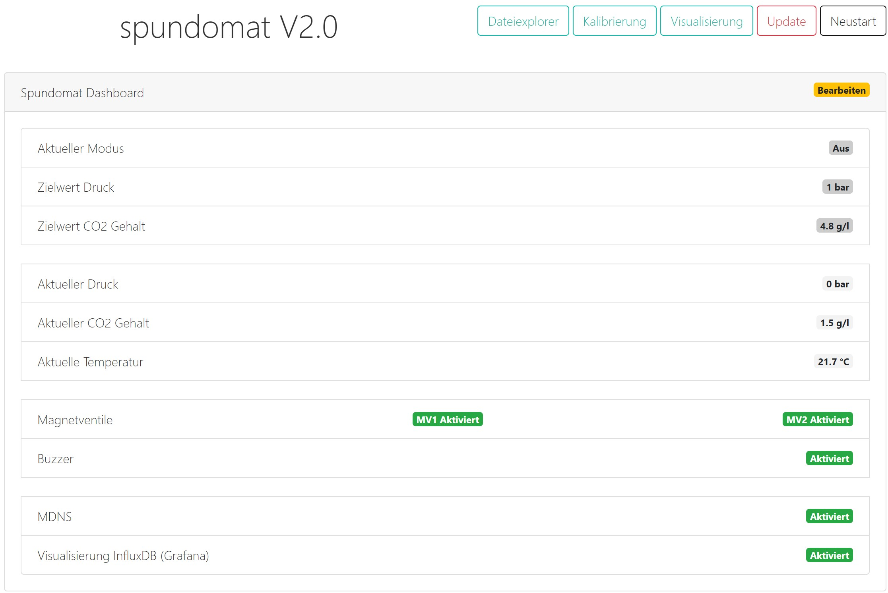
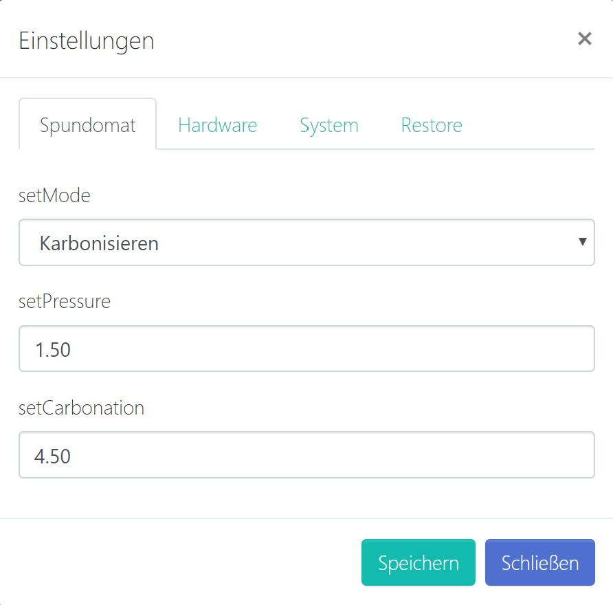
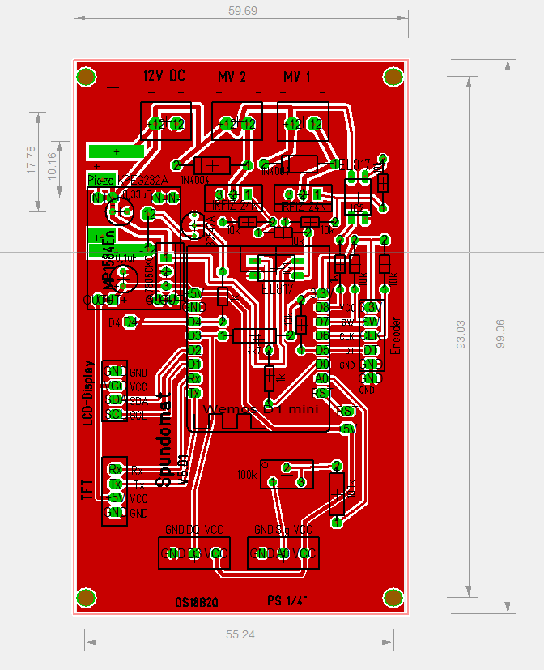
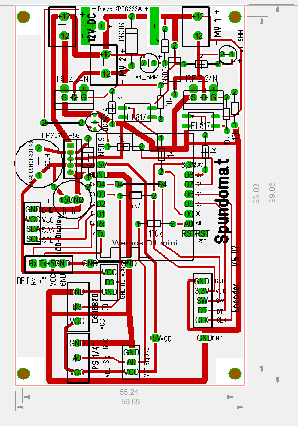
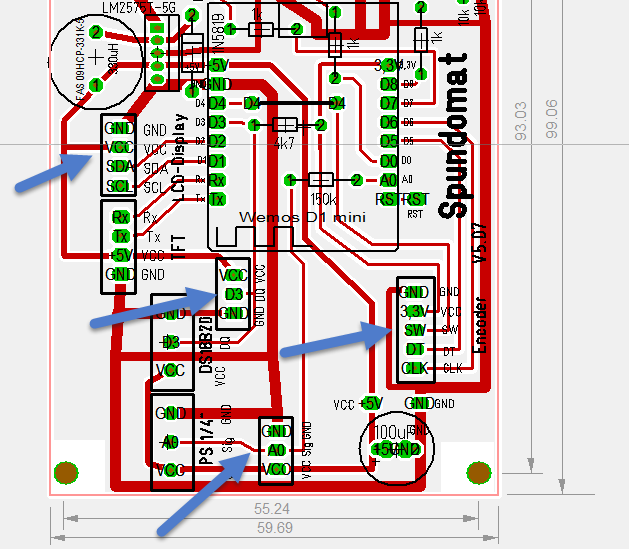
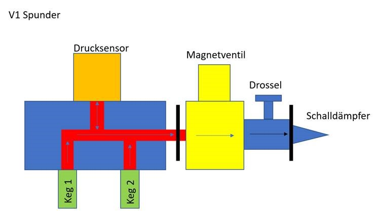
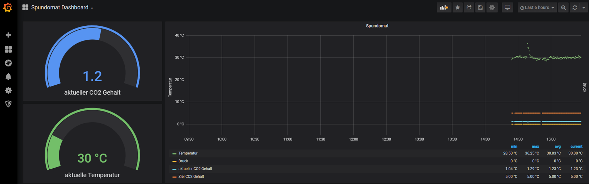

# Spundomat

**Spunden & Karbonisieren:**

Das Projekt Spundomat ist aus dem hobbybrauer Forum entstanden. Der Grundgedanke für den Spundomat liegt in der Automatisierung von wiederkehrenden Ausgaben beim Brauen. Je nach Vorliebe setzen Hobbybrauer das Spunden oder das Karbonisieren ein.

**Spunden** <https://hobbybrauer.de/forum/wiki/doku.php/lagern:spunden>

Unter dem Spunden versteht man Bier in einem druckdicht abgeschlossenen Faß oder Gärbehälter
kontrolliert zu Carbonisieren damit Kohlendioxid im Bier gelöst wird.
Um eine Explosion des Druckfasses zu vermeiden und einen erwünschten Kohlensäuregehalt des Bieres
laut Spundungstabelle zu erreichen muss ein einstellbares Druckbegrenzungsventil,
das Spundventil (Spunddruckregler) am Fass angebracht werden.
Bei der Spundung muss keine genaue Menge an Zucker oder Würze zugegeben und berechnet werden,
weil das Spundventil überschüssiges CO2 automatisch ablässt.
Am einfachsten schlaucht man nach 5-7 Tagen in die Drucktanks oder Kegs und hängt das nach
Tanktemperatur (bzw. Raumtemperatur wenn nicht temperaturreguliert) richtig eingestellte Spundventil an.

Zum Anschließen, Umkonfigurieren, Carbonisieren und leichten Reinigen der CO2-Schäuche eignen
sich Pneumatische Schnellkupplungen hervorragend.

**Karbonisieren** <https://hobbybrauer.de/forum/wiki/doku.php/carbonisieren>

*Unter Karbonisieren oder Aufkarbonisieren versteht man das Einbringen einer bestimmten Menge an Kohlendioxid im Bier. Dabei kann man das CO2 natürlich im Rahmen einer Nachgärung durch Nachwürzen erzeugen, oder von aussen mit einer CO2-Gasflasche und Druckminderer zuführen (Zwangscarbonisieren). Jeder Bierstil hat seinen eigenen typischen Bereich für den im Bier gelösten Kohlendioxidgehalt. Eine Tabelle findet man hier.
Zwangskarbonisieren: Das in einem druckfesten Behälter (Fass, Keg) befindliche nicht mehr gärende Bier mit dem der Temperatur entsprechenden CO2-Druck beaufschlagen und die geöffnete CO2-Flasche so lange dran lassen, bis sich die Manometeranzeige nicht mehr verändert.*

**Was ist Spundomat?**

Der Spundomat automatisiert das Spunden und das Karbonisieren. Zur Automatisierung werden ein Drucksensor und zwei Magnetventile eingesetzt. Die Software öffnet oder schließt das Magnetventil automatisch anhand der Daten vom Drucksensor. Der Spundomat bietet eine Kombination aus Spunden und Karbonisieren.

**Was bietet diese Firmware?**

Die Firmware bietet drei Betriebsmodis:

1. Spunden (Druck ausgehend vom Keg)
2. Karbonisieren (CO2 eingehend in das Keg)
3. Spundomat: die Kombination aus Spunden und Karbonisieren

Zusätzlich bietet die Firmware Ablaufpläne.

Zur Konfiguration und Verwendung kann ein Display mit Encoder (Dreh-Drück-Knopf) oder das Web Interface verwendet werden.

* Web Interface (WebIf) für die Konfiguration
* 2004A Display Integration
* Encoder Unterstützung
* Sensoren
  * Temperatursensoren DS18B20
  * Drucksensor
* Magnetventil ausgehend (Spunden)
* Magnetventil eingehend (Karbonisieren)
* Drucksensor Kalibrierung
* mDNS Support
* Backup / Restore der Konfiguration (config.json) über Dateiexplorer
* Firmware Update über WebIf (Firmware und SPIFFS)

Dieses Projekt wurde im hobbybrauer Forum gestartet und dient dem Informationsaustausch.

---

## Installation

**Installation ohne den Quellcode zu compilieren:**

Mit Hilfe von esptool.exe (<https://github.com/igrr/esptool-ck/releases>) aus dem Ordner tools kann die Firmware auf das ESP Modul geladen werden. Das ESPTool ist für verschiedene Betriebssysteme verfügbar.
ESPtool-ck Copyright (C) 2014 Christian Klippel ck@atelier-klippel.de. This code is licensed under GPL v2.

Unter Win10 wird der USB Treiber CH341SER benötigt: <http://www.wch.cn/download/CH341SER_ZIP.html>

Beispiel für ein ESP8266 Modul vom Typ Wemos D1 mini mit 4MB Flash verbunden mit COM3:

* Von github das Archiv Firmware aus dem Ordner Tools herunterladen und irgendeinem Ordner entpacken

  * Das Archiv enthält das esptool zum Flashen, das Skript Flashen.cmd und die zwei Firmware Dateien

  * Doppelklick auf die Datei Flashen.cmd.

  Sollte COM3 nicht der richtige Anschluss sein, muss im Skript Flashen.cmd an zwei Stellen COM3 durch den richtigen Anschluss ersetzt werden.

  Alternativ manuell mit esptool:
  * Wemos D1 mini löschen: (Beispiel wieder an COM3)
        esptool.exe -cp COM3 -cd nodemcu -ce
        * Flashen:
        esptool.exe -cp COM3 -cd nodemcu -ca 0x000000 -cf spundomat.ino.bin -ca 0x200000 -cf spundomat.spiffs.bin

    * Das ESP8266 Modul resetten

      * Das ESP8266 Modul startet anschließend im Access Point Modus mit der IP Adresse 192.168.4.1

        * Das ESP8266 Modul über einen Webbrowser mit dem WLAN verbinden

        * Anschließend ist das MQTTDevice erreichbar über <http://spundomat>
        je nach Netzwerkumgebung kann es 20-30 Sekunden dauern, bis der mDNS Name aufgelöst wird

**Updates:**

Die Firmware bietet zwei Möglichkeiten, um Updates sehr einfach einspielen zu können.

1. Update durch Dateiupload

    Im Webbrowser die URL <http://spundomat/update> aufrufen.
    Hier kann Firmware und das Filesystem SPIFFS aktualisiert werden. Wenn das Filesystem SPIFFS mit Dateiupload aktualisiert wird, wird die Konfigurationsdatei überschrieben. Siehe hierzu auch Backup und Restore.

2. WebUpdate

    Im Webbrowser die URL <http://spundomat> aufrufen und die Funktion "WebUpdate" aufrufen.
    WebUpdate aktualisiert die Firmware, die index Datei und Zertifikate. Durch WebUpdate wird die Konfigurationsdatei nicht überschrieben.

**Backup and Restore der Konfiguration:**

Der Dateiexplorer ist erreichbar über den Webbrowser <http://spundomat/edit>

1. Backup

    Auf die Datei config.txt klicken und aus dem PopUp Download auswählen.

2. Restore

    Auf "Datei auswählen" klicken, die config.txt auswählen und Upload auswählen.

**mDNS:**

Ein mDNS Name kann anstelle der IP Adresse vom ESP8266 im Webbrowser verwendet werden (<http://mDNSname>). Der Name ist frei wählbar. Der mDNS Name muss im Netzwerk eindeutig sein und darf keine Leer- oder Sonderzeichen enthalten.

---

## Das Dashboard

Das Dashboard vom Spundomat ist das Web Interface. Hier werden alle Informationen zum SPundomat übersichtlich dargestellt.
Auch auf dem LCD Dispaly werden alle benötigten Informationen abhängig vom Betriebsmodus dargestellt. Auf dem LCD Display werden zusätzlich Informationen über das WLAN und die aktuelle IP Adresse angezeigt. Es ist letztlich Geschmackssache, ob das LCD oder das WebIf genutzt wird.

Datei- und WebUpdate sind ausschließlich über das Web interface verfügbar.

---

## Grundeinrichtung

Über das Web Interface ist eine Grundeinrichtung vorzunehmen. Hierunter fällt das Aktivieren der verwendeten Magnetventile und die Kalibrierung.

**Kalibrierung:**

Der Drucksensor vom Spundomat muss vor seiner ersten Verwendung kalibriert werden. Weil es unterschiedliche Drucksensoren und geringfügige Abweichungen bei der Spannungsversorgung gibt, ist eine Kalibrierung obligatorisch.
Der SPundomat funktioniert bereits mit nur einer Kalibrierung bei 0bar. Es wird eine 2-Punkte Kalibrierung empfohlen.

Vorgehensweise Kalibrierung:

Das komplette System muss drucklos sein. Eine CO2 Falsche, ein Keg oder Rückschlagventile sind vom Drucksensor zu trennen. Die Kalibrierung misst die Spannung am analogen Port des Wemos D1 mini bei 0bar. Diese Spannung (Offset) wird im Eeprom des Wemos gespeichert und wird bei der Berechung Druck verwendet.

Eine 2. Kalibrierung bei 2bar vorgenommen. Der Wert für die 2. Kalibrierung ist in den EInstellung auf dem Tab System einstellbar. Eine 2. Kalibrierung unter 2bar wird nicht empfohlen.

**Aktivieren der Magnetventile:**

Über den Button "Bearbeiten" können die Grundeinstellungen von Spundomat konfiguriert werden.
Im Tab Hardware können das Magnetventil 1 (Spunder) und das Magnetventil 2 (Karbonisierer) aktiviert werden. Zu beiden Magnetventilen können die Standardzeiten für das Öffnen und Schließen in Millisekunden konfiguriert werden. In der Grundeinstellung sind 300ms für das Öffnen und 2000ms für das Schließen der Magnetventile vorgegeben.

Der Spundomat kann mit nur einem Magnetventil betrieben werden, wahlweise nur zum Spunden oder nur zum Karbonisieren. Alle Funktionen der Firmware sind nur mit zwei Magnetventilen nutzbar. In der Version 2.0 zum Zeitpunkt 02.2020 blendet keine Funktionen aus, die nicht genutzt werden können.
Der Modus Spundomat und die Ablaufpläne können nur genutzt werden, wenn zwei Magnetventile angeschlossen und aktiviert sind.

**Piezo Buzzer:**

Optional kann ein Piezzo Buzzer aktiviert werden. Die Firmware bietet verschiedene Signaltöne. Mit Version 2.0 zum Zeitpunkt 02.2020 sind die Signaltöne implementiert, jedoch noch nicht an allen möglichen Stellen für ein Warnsignal aktiviert.

**mDNS aktivieren:**

mDNS ist eine einfache Möglichkeit, um den Spundomat mit einem beliebigen Namen anzusprechen. In der Standardkonfiguration ist der Spundomat im Webbrowser über <http://spundomat> erreichbar. In den Grundeinstellungen im Tab System kann mDNS aktiviert und konfiguriert werden. Zu beachten gilt, dass mDNS Namen im Netzwerk eindeutig sein müssen.

**Zeitintervalle für Sensoren:**

Ebenfalls un den Grundeinstellungen im Tab System können die Zeitintervall zum Datenabruf der Sensoren Druck und Temperatur konfiguriert werden. Der Abruf vom Temperatursensor ist als kontinuierlicher Task (Ticker) in der Firmware implementiert. Standardwert ist alle 30 Sekunden.

Das Zeitintervall für das Lesen vom Drucksensor ist lediglich eine Grundeinstellung. Je nach Anforderung und Betriebsmodus werden Daten bei Bedarf und nicht nach Ablauf eines Zeitintervalls abgefragt. In Ablaufplänen wird das Abfrageintervall für den Durcksensor deaktiviert und nach den konfigurierten Zeiten für das Öffenen und Schließen der Magnetventile der Durcksensor abgefragt. Der Standardwert lautet 1000ms.

**Grafana:**

Der Spundomat unterstützt die Visualisierung mit der OpenSource Software Grafana. Der Spundomat schreibt direkt in die Datenbank InfluxDB. Es wird aktuell nur die lokale Installation unterstützt. Folgende Parameter sind erforderlich:

* Influx Datenbank Server: <http://raspberrypi_IP:8086>

  Die URL besteht aus der IP Adresse vom RaspberryPI und dem Port getrennt durch ein Doppelpunkt besteht. Der Standard-Port ist 8086.
* Datenbank Name: hier muss der Name der Datenbank in Influx eingetragen werden. Standard: spundomat (siehe Installation und Konfiguration Datenbank)
* Benutzername und Password (optional - siehe Installation und Konfiguration Datenbank)
* Update Intervall: Zeitintervall in Minuten. Default: 5 Minuten

  Das Update Intervall gibt an, wie häufig der Spundomat seine Sensordaten in die Datenbank schreibt.

Wenn die Option Grafana erstmalig aktiviert wird, muss der Spundomat einmal neu gestartet werden.

**Restore:**

Das Menü für die Grundeinstellung bietet Funktionen, um Einstellungen und KOnfigurationen vom Wemos D1 mini zu löschen. Zur Auswahl stehen

* lösche Kalibrierung. Hiermit wird der im Eeprom gespeicherte Offset und die Kalibrierung bei 2bar aus der Konfiguration für den Durcksensor gelöscht.
* Lösche WiFi
* Reset to defaults (Lösche WiFi, lösche 0bar Kalibrierung aus dem Eeprom und lösche die Spundomat Konfigruation)

---

## Der Spundomat im Betrieb

Über den Button "Bearbeiten" kann der Betriebsmodus für den Spundomat ausgewählt werden. Es wird zwischen zwei Betriebsmodis unterschieden:

* Spunden
* Karbonisieren

**Spunden:**

Der Betriebsmodus Spunden ist für Brauer geeignet, die mit Speise, Zucker oder Grünschlauchen für eine Nachgärung im Keg arbeiten. Im Modus "Spundomat CO2-Gehalt" wird auf Basis der gemessenen Temperatur und dem eingestellten Zielwert CO2-Gehalt in gr/l der erforderliche Druck im Keg berechnet. Das Spunden CO2-Gehalt ist ein automatisiertes Ablassen von Druck aus dem Keg oberhalb des Drucks für den gewünschten CO2-Gehalt. Ändert sich die Temperatur während der Nachgärung oder Reifung ermittelt der Spundomat automatisch den korrekten Druck.

Ein eher seltener genutzer Modus ist das Spunden auf Basis Druck in bar. Der Prozess Druck ablassen basiert in diesem Modus auf dem gemessenen Wert vom Drucksensor.

**Karbonisieren:**

Der Betriebsmodus Karbonisieren ist für Brauer geeignet, die ein endvergorenes Jungbier ins Keg schlauchen und das Keg mit COS2 auf einen bestimmten Druck zur Reifung einstellen. Der Druck wird meist aus einer Tabelle in Abhängigkeit von der Temperatur ermittelt. Der Spundomat ermittelt den benötigten Druck automatisch und führt CO2 in das Keg. Ändert sich die Temperatur während der Bierreifung ermittelt der Spundomat automatisch den korrekten Druck.

Ebenfalls ein eher seltener genutzer Modus ist das Karbonisieren auf Basis Druck in bar. Der Prozess Karbonisieren basiert in diesem Modus auf dem gemessenen Wert vom Drucksensor.

**Der Spundomat Modus:**

Der Modus Spundomat fügt die zwei Betriebsmodis Spunden und Karbonisieren auf Basis CO2-Gehalt zusammen. Dieser Modus basiert auf dem Zielwert CO2-Gehalt. Druck im Keg oberhalb wird automatisch abgelassen. Druck unterhalb führt automatisch zum Zuführen von CO2. Dieser Modus ermittelt während der Nachgärung und Reifung Temperaturänderung und berechnet den erforderlichen Druck im Keg neu.

Zusätzlich bietet die Firmware eine Verzögerung für die Karbonisierung. In einfachen Worten: starte die Nachgärung im Keg und baue Druck langsam auf. Nach einer einstellabren Zeit bspw. nach 2-3 Tagen oder ab einem durch Nachgärung aufgebautem Druck starte die Karbonisierung.

Für eine Verzögerung der Karbonisierung kann als Parameter die Zeit (in Minuten oder Stunden) oder Parameter vorhandener Mindest-CO2 Gehalt gennutzt werden. Beide Verzögerungen für die Karbonisierung bieten der Hefe Zeit für die Nachgärung. Die Verzögerung wird meist dann angewendet, wenn sehr früh im Gärungsprozess geschlaucht werden soll.

**Vorgehensweise Betriebsmodus:**

Wird Nachgärung im Keg eingesetzt kann je nach Präferenz mit dem Modus Spunden-CO2 oder im Modus Spundomat gestartet werden. Manche Hobbybrauer möchten in den ersten Tagen Nachgärung im Keg den Druck langsam aufbauen. Bei dieser Anforderung wird im Spunden-CO2 Modus gestartet. Alternativ kann der Spundomat Modus mit Verzögerung für das Karbonisieren genutzt werden.

Wird ein endvergörenes Jungsbier ins Keg geschlaucht, ist der Spundomat Modus die beste Wahl. In diesem Modus startet die Reifung mit dem Zieldruck. Überschüssiger Druck, bspw. durch geringe Nachgärung, wird automatisch abgelassen. Zu geringer Druck wird automatisch zugeführt.

**Zeitintervalle für die Magnetventile:**

Alle drei Betriebsmodus haben gemeinsam, dass die einstellbaren Zeitintervalle darüber entscheiden, ob der Spundomat sehr schnell oder sehr träge auf Druckänderung reagiert. Grundsätzlich ist der Prozess Nachgärung und Reifung ein über viele Tage laufender Prozess. Eine Druckänderung im Keg wird sich ebenfalls über viele Stunden und Tage herstellen und nicht binnen Sekunden oder Minuten. Dementsprechend ist ein permantes schnelles Öffnen und Schließen der Ventile nicht notwendig.

Für jedes Magnetventil wird ein Zeitintervall Öffnen und ein Zeitintervall Schließen konfiguriert. Die Zeitangabe ist in Millisekunden. Während der Nachgärung und Reifung sind beispielhaft folgende Zeitintervalle geeignet:

* Öffne Magnetventil 1 (Spunden) für 500ms, wenn der vorhandene Druck über dem Zieldruck liegt
* Schließe nach dem Öffnen Magnetventil 1 für 360000ms (1 Minute)

Diese Zeitintervalle bewirken nun, dass bei überschüssigen Druck im Keg 1x pro Minute für 500ms Druck abgelassen wird. Während das Ventil geschlossen ist, wird der aktuelle Druck am Sensor abgelesen. Ist weiterhin überschüssiger Druck vorhanden, wiederholt sich das Öffnen für 500ms und das Schließen für 1 Minute. Ist der Druck geringer oder gleich dem Zielwert, öffnet sich Ventil 1 nicht.

Im Modus Spundomat wechseln sich Magnetventil 1 (Spunder) und Magnetventil 2 (Karbonisierer) ab. Es beginnt Ventil 1 mit der Überprüfung, ob überschüssiger Druck vorliegt. Falls ja findet der oben beschriebene Prozess Öffnen-Schließen statt. Anschließend prüft Ventil 2, ob zu geringer Druck vorliegt. Falls ja findet wieder der oben beschriebene Prozess Öffnen-Schließen statt, aber dieses Mal am Magnetventil vor der CO2-Flasche.
Die Zeitintervalle, insbesondere die Werte für Ventile geschlossen, entscheiden nun über die Häufigkeit der Überprüfung.

Noch in der Umsetzung befindet sich die Anbindung an den TCPServer iSpindel (Tozzi Server) für eine Visualisierung der Gärung und Reifung.

---

## Ablaufpläne

Die Firmware bietet die Möglichkeit drei unterschiedliche Ablaufpläne zu nutzen.

**Was sind Ablaufpläne?**

Ein Ablaufplan ist eine automatisierte zeitliche Abfolge von Öffnen und Schließen der zwei Magnetventile. Zum Zeitpunkt 02.2020 wurden beispielhaft die Ablaufpläne

* KEG Entlüften
* Schnelles Zwangskarbonisieren
* CO2 Wäsche

der Firmware beigefügt. Alle Ablaufpläne müssen auf die individuelle Umgebung und Anforderungen angepasst werden.

**Unterschied Betriebmodis vs. Ablaufplan:**

Ein Betriebsmodus wie bspw. der Spundomat Modus läuft bis zum manuellen Beenden mit konstanten Parametern für Zieldruck und Intervallen der Magnetventile.
EIn Ablaufplan hat maximal 20 Wiederholungen und kann in jeder Wiederholung mit anderen Parameter durchgeführt werden.

Ablaufpläne sollen definierte Aufgaben durchführen. Betriebmodis sollen über einen längeren Zeitraum bspw. 2-4 Wochen die Nachgärung und damit den CO2-Gehalt im Jungbier kontrolliert auf den gewünschten CO2-Gehalt bringen. Im Idealfall ohne regelmäßige Eingriffe durch den Hobbybrauer.

**Aufbau der Ablaufpläne:**

Ablaufpläne werden in der Textdatei ablaufplan.txt definiert. Über den Dateiexplorer im Web Interface kann die Textdatei editiert werden. Zum Speichern wird im Dateiexplorer die Tastenkombination CTRL + S verwendet.

Ein Ablaufplan beginnt mit einer Namensgebung. Die Namensgebung beginnt mit dem Kennzeichner #
Jeder Ablaufplan hat einen Namen für das LCD Display und einen (meist längeren Namen) für das Web Interface. Als Trennzeichen zwischen diesen zwei Namen wird das Semikolon verwendet:

Beispiel: #P1 Entlüften;Plan 1 Keg entlüften

Der Ablaufplan wird im LCD Display mit dem Namen "P1 Entlüften" angezeigt. Im Web Interface mit dem Namen "Plan 1 Keg entlüften".
Auf die Namensgebung für einen Ablaufplan folgt der zeitlichen Ablauf für das Öffnen und Schließen der zwei Magnetventile. Als Trennzeichen wird wieder das Semikolon verwendet. Es wird folgendes Format verwendet: (MV1 = Magnetventil 1, MV2 = Magnetventil 2).

Zieldruck MV1 ; Öffne MV1 ; Schließe MV1 ; Zieldruck MV2 ; Öffne MV2 ; Schließe MV2

Dabei verstehen sich die Angaben Öffne und Schließe als Zeit in Millisekunden. Zur Erinnerung: MV1 lässt Druck ab, während MV2 CO2 zuführt.

Beispiel: 0.1;400;2000;1.0;300;4000

Zieldruck MV1: 0.1 bar
Um den Zieldruck von 0.1bar zu erreicchen, öffne das Magnetventil 1 für 400ms. Danach schließe es für 2000ms. Diese Abfolge wird wiederholt, bis der Zieldruck 0.1bar erreicht ist. Dann folgt das Magnetventil 2.
Zieldruck MV2: 1.0bar
Um den Zieldruck von 1.0bar zu erreichen, öffne das Magnetventil 2 für 300ms. Danach schließe es für 4000ms. Diese Abfolge wird wiederholt, bis der Zieldruck 1.0bar erreicht ist. Dann folgt der nächste Schritt.

Ein Ablaufplan kann bis zu 20 Schritte enthalten. Jeder Schritt ist also ein Sequenz aus

* Lasse über Magnetventil 1 Druck aus dem Keg ab
* Fülle CO2 über das Megnetventil 2 in das Keg

**Der Versuch "schnelles Zwangskarbonisieren" in Verbindung mit dem Spundomaten in Worten zu beschreiben:**

Beim Zwangskarbonisieren versucht der Brauer, den gelösten CO2-Gehalt im Bier schnellstmöglich auf einen gewünschten Zielwert herzustellen. Eine gängige Methode ist das Befüllen des Kegs mit CO2 mit anschließendem "Rollen & Rütteln".
Mit dem Spundomat kann nun ein automatisierter Prozess gestartet werden. Bei einer Bier Temperatur von 7°C und und einem gewünschten CO2-Gehalt von 4.5gr/l müsste ein Druck im Keg von ca. 0.7 bis 0.8bar hergestellt werden. Um diesen CO2-Gehalt schnellstmöglich herzustellen, kann folgende Vorgehensweise helfen:

* Leite CO2 über den Getränkeanschluss durch das Bier in das Keg
* Lasse Druck über den CO2-Anschluss aus dem Keg heraus

Mit dem Ablaufplan "Schnelles Zwangskarbonisieren" und dem oben skizzierten Anschluss Keg kann nun die CO2-Zuführung durch den Getränkeanschluss sehr genau getaktet werden: (zur Verbesserung der Lesbarkeit wurden Leerzeichen eingefügt!)

0.0 ; 0; 0 ; 0.8 ; 100; 3000

0.1 ; 500 ; 2000 ; 0.8 ; 100; 3000

0.1 ; 500 ; 2000 ; 0.8 ; 100 ; 3000

Diese Schritte bewirken:
Ein Druck von 0.0bnar wieder übersprungen. Das bedeutet: Magnetventil 1 macht im ersten Schritt nichts und der Ablaufplan springt direkt zu Magnetventil 2.
Magnetventil 2 soll einen Zieldruck von 0.8bar herstellen. Um diesen Druck im Keg zu erreichen wird das Ventil 100ms geöffnet und danach für 3000ms geschlossen. Bis der Zieldruck von 0.8bar erreicht ist, wird also das Magnetventil 2 immer wieder für 100ms geöffnet und danach für 3 Sekunden geschlossen.
Mit dieser Taktung kann gezielt CO2 in das Keg gedrückt werden. Die kurze Öffnungszeit von nur 100ms gegenüber der langen Zeit Ventil geschlossen verhindert ein starkes Schäumen im Keg. Das Ziel beim schnellen Zwangskarbonisieren ist ein "feines durchblubbern" um CO2 im Bier zu binden.
In Schritt 2 kommt Magnetventil 1 zum Einsatz. Der vorhandene Druck von 0.8bar soll auf 0.1bar abgebaut werden. Wieder kommt die Sequenz Öffnen und Schließen zum Einsatz: lasse Druck ab durch öffnen von MV1 für 500ms. Warte dann mit einem geschlossenen MV1 2000ms ab, bevor der Vorgang wiederholt wird.
Diese Schritte lassen sich nun bis zu 20x wiederholen. Ein Ablaufplan kann also von nur wenigen Sekunden bis hin zu mehreren Stunden andauern. Die Parameter Öffnen und Schließen sind individuell für jede Umgebung anzupassen. Der vorgefertigte Ablaufplan ist nur als Hilfe gedacht!

Während beim "schnellen Zwangskarbonisieren" das Binden von CO2 im Bier im Vordergrund steht, ist bei der CO2-Wäsche das Austreiben von Fehlarmonen die Hauptaufgabe. Eine Nebenwirkung der CO2-Wäsche ist sogar, dass der CO2-Gehalt am Ende der Wäsche niedriger ist. Hierfür wird das Bier stark mit einem Druck von 3 oder sogar 4bar durchströmt. Mit kräftigen Sequenzen CO2 durch das Bier sollen Fehlaromen wie bspw. Schwefelgerüche ausgetrieben werden. Zu beachten ist das Schäumen! Das Schließen der Magnetventile sind (immer) wie Pausenzeiten zu verstehen. Wenn durch ein Bier CO2 mit 4bar "durchgeschossen" wird, ist Schaumbildung unvermeidlich. Je geringer der freie Kopfraum im Keg, desto höher ist die Gefahr, dass Schaum oder ganz allgemein Flüssigkeit über die Druckschläuche zu den Magnetventilen gelangen kann.

Sowohl Ablaufplanname als auch die Sequenzen Öffnen und Schließen für beide Magnetventile können individuell angepasst werden. Die drei Ablaufpläne im Repository sind als Starthilfe gedacht und sollen vom Endanwender überschrieben werden. Es wird empfohlen, das Editieren der Datei ablaufplan.txt über den Dateiexplorer im Web Interface der Firmware durchzuführen, weil das Formatkennzeichen für Zeilenende und Zeilenvorschub unterschiedlich abgespeichert wird.

* Hinweis: rechte Maustaste auf die Datei ablaufplan.txt -> Edit auswählen
* Hinweis: Speichern der Änderung mit der Tastenkombination CTRL + S

---

## Die Spundomat Platine

**Wichtiger Hinweis:**

Die Platine ist aus einem Hobby-Projekt entstanden. Eine fertig bestückte Platine wird nicht angeboten. Das Projekt verfolgt keinerlei kommerzielle Absichten. Die hier geteilten Informationen stellen einen Entwicklungszustand dar und dienen der Weiterentwicklung sowie der Überprüfung, Korrektur und Verbesserung. Inhalte aus externen Links (bspw. Forum hobbybrauer) und Angaben zu externen Inhalten (bspw. Artikel verschiedener Anbieter) unterliegen den jeweiligen Rechten der Inhaber. Externe Inhalte sind ausschließlich als informative Starthilfe anzusehen.

*Alle Informationen über die Platine sind rein informativ und können falsch sein. Verwendung dieser Informationen auf eigene Gefahr. Jegliche Haftung wird ausgeschlossen.*

In diesem Projekt wurde eine Platine für den Spundomat entwickelt, um mit Klemmschraubblöcken eine einfache Anbindung an Sensoren und Magnetventile zu bieten. Die Platine ist mit wenigen elektronsichen Bauteilen bestückt. Der Aufbau erfordert ein Grundwissen und Grundkenntnisse im Bereich der Elektrotechnik.
Die Platine bietet folgende Vorteile:

* der Wemos D1 mini steckt auf einem Sockel und kann jederzeit abgenommen werden.
* die Stromversorgung vom Wemos wird über ein Netzteil 12V/2A und einem Spannungsregler LM 2575T-5G hergestellt.
* Sensoren, Display, Encoder und Magnetventile können direkt an die Schraubklemmen angeschlossen werden.
* LEDs für beide Magnetventile
* Piezzo Buzzer

Beschreibung:

**Elektronikbautteilliste:**

| Anzahl | Artikel | Link |
| ------ | ------- | ---- |
|5 | Widerstand 1 k | <https://www.reichelt.de/widerstand-metallschicht-1-00-kohm-0207-0-6-w-1-metall-1-00k-p11403.html?&nbc=1> |
|1 | Widerstand 4 k7 | <https://www.reichelt.de/widerstand-metallschicht-4-7-kohm-0207-0-6-w-1-k-o-sfcn4701t52-p237245.html?&trstct=pos_0&nbc=1> |
|4 | Widerstand  10 k | <https://www.reichelt.de/widerstand-metallschicht-10-0-kohm-0207-0-6-w-1-metall-10-0k-p11449.html?&nbc=1> |
|1 | Widerstand  150 k | <https://www.reichelt.de/widerstand-metallschicht-150-kohm-0207-0-6-w-1-k-o-sfcn1503t52-p237322.html?&nbc=1> |
|1 | Diode  1N 5819 | <https://www.reichelt.de/schottkydiode-40-v-1-a-do-41-1n-5819-p41850.html?&nbc=1> |
|2 | Dioden  1N 4004 | <https://www.reichelt.de/gleichrichterdiode-400-v-1-a-do-41-1n-4004-p1726.html?&trstct=pos_0&nbc=1> |
|1 | LED 5mm rot | <https://www.reichelt.de/led-5-mm-bedrahtet-rot-1800-mcd-30-l-7113srd-j4-kb-p219690.html?&nbc=1> |
|1 | LED 5 mm blau | <https://www.reichelt.de/led-5-mm-bedrahtet-blau-800-mcd-60-led-5mm-bl-p61102.html?r=1> |
|1 | Transistor BC 547 A | <https://www.reichelt.de/bipolartransistor-npn-45v-0-1a-0-5w-to-92-bc-547a-p219128.html?&nbc=1> |
|2 | Optokoppler EL 817 | <https://www.reichelt.de/optokoppler-5kv-35v-50ma-50-dip4-el-817-p146657.html?&nbc=1> |
|2 | MosFet IRFIZ 24 N | <https://www.reichelt.de/mosfet-n-ch-55v-14a-29w-to-220-fullpak-irfiz-24n-p90327.html?&nbc=1> |
|1 | Elko 100 uF/ 35 V stehend | <https://www.reichelt.de/elko-radial-100-uf-35-v-105-c-low-esr-aec-q200-rad-fc-100-35-p84619.html?&nbc=1> |
|1 | Drossel 33uH    FAS 09HCP-331K-5 | <https://www.reichelt.de/power-induktivitaet-radial-330-h-fas-09hcp-331k-5-p245783.html?&nbc=1> |
|1 | Schaltregler   LM 2575 - 5G | <https://www.ebay.at/itm/1-4-Pneumatik-Magnetventil-12V-DC-Electric-Solenoid-Valve-fur-Wasser-Luft-s0d/123512299808?hash=item1cc1e82120:g:zNEAAOSwMhVb~BfR> |
|3 | Klemmblöcke 2- polig RM5,08 | <https://www.reichelt.de/loetbare-schraubklemme-2-pol-rm-5-08-mm-90-rnd-205-00287-p170288.html?&nbc=1> |
|2 | Klemmblöcke 3- polig RM 3,81 | <https://www.reichelt.de/anschlussklemme-3-pol-1-5-mm-rm-3-81-akl-086-03-p72034.html?&nbc=1> |
|1 | Klemmblock  5- polig RM 2,54 |
|1 | Klemmblock  4- polig RM 2,54 |
|1 | Piezosummer KPE 232A | <https://www.reichelt.de/piezosummer-summer-kpe-232a-p35920.html?&nbc=1> |
|1 | XLR Buchse 3- polig | <https://www.reichelt.de/xlr-einbaubuchse-3-polig-mit-verriegelung-xlr-3eb-p22899.html?&nbc=1> |
|1 | XLR Stecker 3- polig | <https://www.reichelt.de/xlr-stecker-3-polig-vernickelte-kontakte-xlr-3st-n-p40793.html?&nbc=1> |
|1 | Schalter | <https://www.reichelt.de/wippschalter-1x-aus-schwarz-i-o-wippe-1801-1146-p36770.html?&nbc=1> |
|1 | Encoder  KY 040 | <https://www.ebay.de/itm/Potentiometer-Drehregler-KY-040-Rotary-Encoder-Drehgeber-Taster-Poti-Arduino/254138168087?hash=item3b2bd0b317:g:p9oAAOSw94NccoFi> |
|1 | Wemos D1 mini |
|1 | Steckernetzteil 12V / 2A |
|1 | Drucksensor  0- 0,5 Mpa /1/4" | <https://www.ebay.at/itm/G1-4-OLDRUCKSENSOR-Drucksensor-0-0-5-MPa-Fur-Oil-Fuel-Diesel-Gas-Wasser-Luft/371961467626?hash=item569aa192ea:g:SMEAAOSwlY1ZFbm~> |
|1 | DS 18B20 Temperatursensor |
|1 | LCD Display 2004 |
|2 | Magnetventile 12 V -1/4" | <https://www.ebay.at/itm/1-4-Pneumatik-Magnetventil-12V-DC-Electric-Solenoid-Valve-fur-Wasser-Luft-s0d/123512299808?hash=item1cc1e82120:g:zNEAAOSwMhVb~BfR> |
|4 | Distanzhülsen | <https://www.reichelt.de/distanzhuelsen-metall-6-kant-m3-15mm-da-15mm-p7018.html?&nbc=1> |

**Pneumatikkomponenten:**

| Anzahl | Artikel | Link |
| ------ | ------- | ---- |
| 1 | Schalldämpfer 1/4" | <https://hydrocontrol.fittingline.com/artikel/de/schalldaempfer-g-14-sinterbronze/SD%2014> |
| 1 | Rückschlagventil 6mm-1/4" | <https://hydrocontrol.fittingline.com/artikel/de/rueckschlagventil-r-14-6mm-durchfluss-vom-gewinde-zum-schlauch-iqs-standard/HAIQS%20146> |
| 2 | Steckanschlüsse 6mm -1/8" | <https://hydrocontrol.fittingline.com/artikel/de/gerader-steckanschluss-g-18-6mm-iqs-standard/IQSG%20186%20G> |
| 3 | Steckanschlüsse 6mm -1/4" | <https://hydrocontrol.fittingline.com/artikel/de/gerader-steckanschluss-g-14-6mm-iqs-standard/IQSG%20146%20G> |
| 1 | Verteilerblock 2x 1/4" -2x 1/8" | <https://hydrocontrol.fittingline.com/artikel/de/verteilerleiste-2-x-g-14-2-x-g-18-aluminium-eloxiert/RLE2%201418%20A> |
| 1 | Y-Steckverbinder 8-6mm | <https://hydrocontrol.fittingline.com/artikel/de/y-steckanschluss-8mm-6mm-iqs-standard/IQSY%208060> |
| 1 | Rückschlagventil 6 mm | <https://hydrocontrol.fittingline.com/artikel/de/steckanschluss-rueckschlagventil-6mm-iqs-standard/HIQS%2060> |
| 1 | Rückschlagventil 8mm | <https://hydrocontrol.fittingline.com/artikel/de/steckanschluss-rueckschlagventil-8mm-iqs-standard/HIQS%2080> |
| 1 |  Schlauch 6 mm ca. 2 mt | <https://hydrocontrol.fittingline.com/artikel/de/polyurethan-schlauch-6-x-4-mm-silber/PUN%206X4%20SILBER> |
| 1 | Schlauch 8 mm ca. 1 mt | <https://hydrocontrol.fittingline.com/artikel/de/polyurethan-schlauch-8-x-5-mm-schwarz/PUN%208X5%20SCHWARZ> |

**Aufbau:**

Vor der Inbetriebnahme mit einem Wemos D1 mini muss

* der Trimmpoti auf 50kOhm eingestellt werden
* der LM 2575T-5G ausgehend auf 5V eingestellt

Diese Einstellungen müsen vorab durchgeführt werden! Ohne diese Einstellung kann der Wemos D1 mini zerstört werden!

Grundsätzlich können für das LCD- Display, Encoder, Sensoren sowohl Klemmblöcke mit RM 2,54 als auch PSK -Platinen-Steckverbinder verwendet werden
<https://www.reichelt.de/kupplungs-leergehaeuse-crimptechnik-2-polig-psk-254-2w-p14857.html?&nbc=1&trstct=lsbght_sldr::14861>
<!-- -->
<https://www.reichelt.de/printstecker-einzelstecker-gerade-5-polig-pss-254-5g-p14911.html?&nbc=1>
<!-- -->
Allerdings benötigt man dafür eine spezielle Crimpzange

* einlöten der beiden Brücken ( auf der Platine markiert)

* alle Widerstände bestücken

* alle Dioden, LED lt. Aufdruck bestücken

* restliche Bauteile einlöten

* zuletzt die beiden MosFet und den Schaltregler LM 2575T-5G einlöten > die Anschlussdrähte nicht zu lange belassen ( max. 10 mm) da sonst die Bauteile über den Gehäuserand ragen.

* anschließend die beiden 8-poligen Steckleisten für den Wemos bestücken

* am Wemos werden die Buchsenleisten verwendet

* weiters alle Klemmblöcke ( oder Steckverbinder wer damit arbeitet) bestücken

* die blauen Pfeile markieren die PSK -Steckverbinder

* TFT muss vorerst nicht bestückt werden ( optional, falls jemand damit arbeiten möchte)

* der Piezo -Summer wird an der Platinenunterseite auf die beiden Pins aufgelötet - Vorsicht Polarität! > violetter Pfeil ist der Pluspol

Die Montage des LCD-Displays, der Platine und des Encoders erfolgt in dieser Reihenfolge

* zuerst das Display mit 4 Distanzhülsen ( M3 x 15) am Gehäuse verschrauben
<https://www.reichelt.de/distanzhuelsen-metall-6-kant-m3-15mm-da-15mm-p7018.html?&nbc=1>

* darauf mittels M3 x 6 (8 ) mm Schrauben die Platine befestigen

* zuletzt den Encoder mit M2,5 x 6 mm Schrauben befestigen ( leider passen beim Encoder keine M3 Schrauben)

Die Verkabelung kann mit Flachbandlitzen durchgeführt werden.

**Hardware: Anschlussmöglichkeiten Drucksensor und Magnetventil:**

1. Möglichkeit: Spunder

    

2. Möglichkeit: Zwangskarbonisierung

---

## Visualisierung

Der Spundomat unterstützt die Visualisierung mit der OpenSource Grafana. Zum aktuellen Zeitpunkt wird nur die lokalen Version unterstützt. In dieser Anleitung wird die Installation und Konfiguration auf einem RaspberryPi beschrieben.

**Vor der Installation:**

Vor der Installation sollte der Raspberry aktualisiert werden:

`sudo apt-get update`

`sudo apt-get upgrade`

`sudo reboot`

**Installation Datenbank:**

Installation der Datenbank InfluxDB:

Mit shh (bspw. Putty) anmelden und die folgenden Befehle ausführen

`wget -qO- <https://repos.influxdata.com/influxdb.key> | sudo apt-key add -`
  
*ENTWEDER*  wenn auf dem RaspberryPi die OS Version "stretch" installiert ist

`echo "deb <https://repos.influxdata.com/debian> stretch stable" | sudo tee /etc/apt/sources.list.d/influxdb.list`
  
*ODER*      wenn auf dem RaspberryPi die OS Version "buster" installiert ist
  
`echo "deb <https://repos.influxdata.com/debian> buster stable" | sudo tee /etc/apt/sources.list.d/influxdb.list`

`sudo apt update`

`sudo apt install influxdb`

`sudo systemctl unmask influxdb`

`sudo systemctl enable influxdb`

Die Datenbank InfluxDB ist mit diesen 6 Schritten installiert und startet automatisch bei jedem Neustart vom RaspberryPi

**Konfiguration Datenbank:**

Datenbank und Benutzer einrichten:

Mit shh (bspw. Putty) anmelden und den folgenden Befehl ausführen

`influx`

Die folgenden Datenbank Befehle der Reihe nach eingeben. Das Password xxx durch ein eigenes Password ersetzen. Die Anführungstriche müssen bleiben!

`CREATE DATABASE spundomat`

`CREATE USER pi WITH PASSWORD 'xxx' WITH ALL PRIVILEGES`

Zugriff auf die Datenbank einrichten:

`sudo nano /etc/influxdb/influxdb.conf`

  Mit der Tastenkombination Strg+W nach HTTP suchen. In diesem Abschnitt muss mindestens aktiviert werden:

`enabled = true`

`bind-address = ":8086"`

Diese zwei Einträge sind das Minimum. Es wird dringend empfohlen, eine Benutzer und Password Abfrage zu aktivieren.
Die Änderung wird mit der Tastenkombination Strg+O gespeichert. Den Editor beenden mit Strg+X.

Abschließend muss die Datenbank neu gestartet werden:

`sudo systemctl restart influxdb`

**Installation Grafana:**

Vor der Eingabe der Befehle die aktuelle Version Grafana überprüfen und in Schritt 1 und 2 die Versionsnummer 6.6.1 ersetzen.

`wget <https://dl.grafana.com/oss/release/grafana_6.6.1_armhf.deb>`

`sudo dpkg -i grafana_6.6.1_armhf.deb`

`sudo systemctl enable grafana-server`

`sudo systemctl start grafana-server`

Im Grafana Web Interface muss nun abschließend nur noch die DataSource InfluxDB hinzugefügt werden.

`URL: <http://ip_rasberrypi:8086>`

`Database: spundomat`

`User: pi`

`Password: xxx`

`HTTP Method: POST`

Mit "Save & Test" wird die Verbindung gespeichert und überprüft. Nun kann entweder das Beispiel-Dashboard Spundomat (Datei Spundomat Dashboard.json) aus dem Ordner Info in Grafana importiert oder ein eigenes Dashboard erstellt werden.
