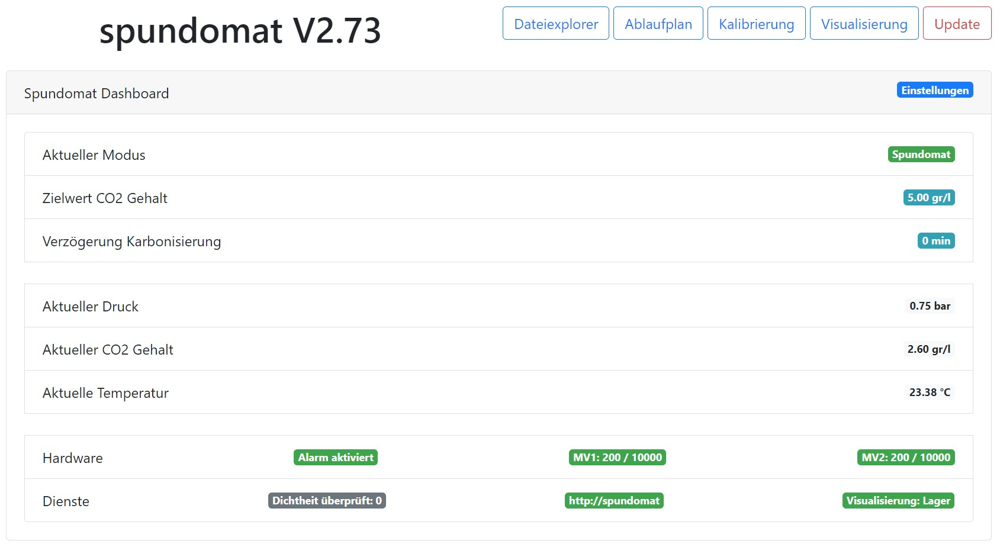
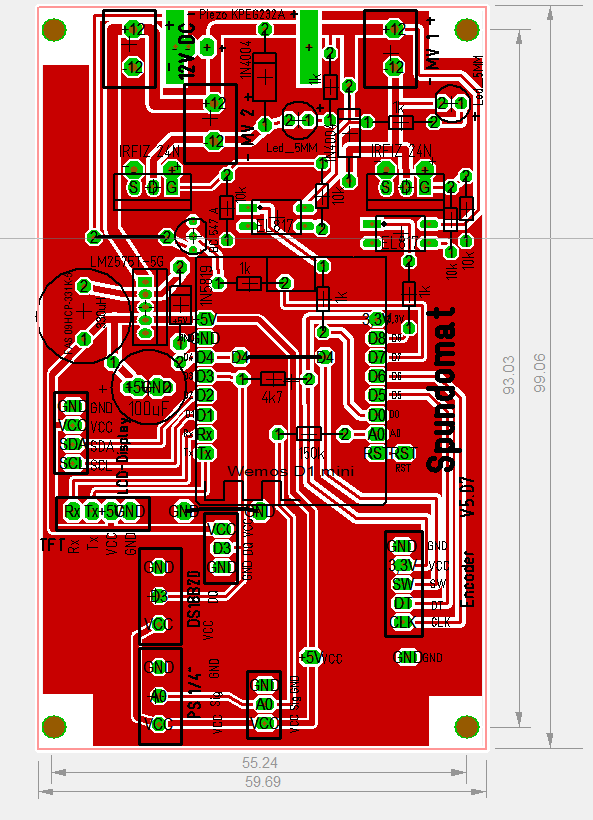
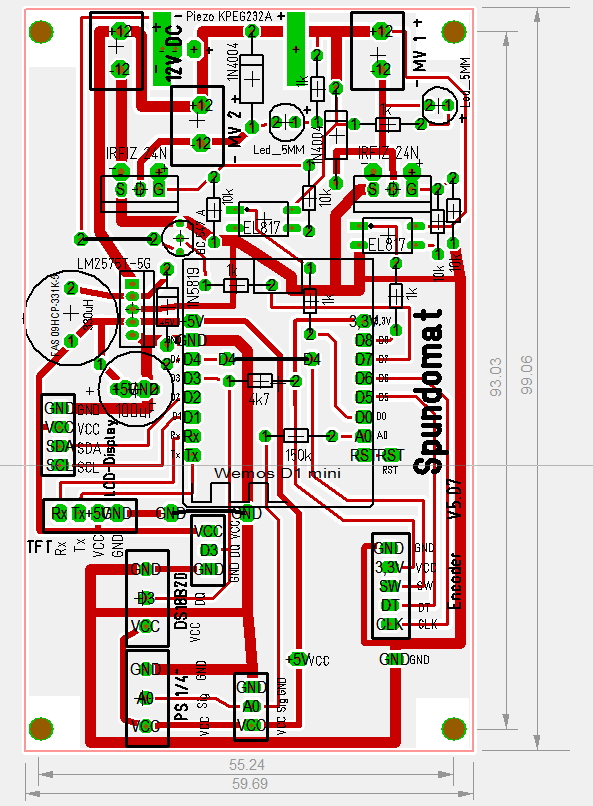

# Spundomat

**Spunden & Karbonisieren**

Das Projekt Spundomat ist aus dem hobbybrauer Forum entstanden. Der Grundgedanke für den Spundomat liegt in der Automatisierung von wiederkehrenden Ausgaben beim Brauen. Je nach Vorliebe setzen Hobbybrauer das Spunden oder das Karbonisieren ein. 

**Spunden** https://hobbybrauer.de/forum/wiki/doku.php/lagern:spunden

Unter dem Spunden versteht man Bier in einem druckdicht abgeschlossenen Faß oder Gärbehälter 
kontrolliert zu Carbonisieren damit Kohlendioxid im Bier gelöst wird. 
Um eine Explosion des Druckfasses zu vermeiden und einen erwünschten Kohlensäuregehalt des Bieres 
laut Spundungstabelle zu erreichen muss ein einstellbares Druckbegrenzungsventil, 
das Spundventil (Spunddruckregler) am Fass angebracht werden. 
Bei der Spundung muss keine genaue Menge an Zucker oder Würze zugegeben und berechnet werden, 
weil das Spundventil überschüssiges CO2 automatisch ablässt.
Am einfachsten schlaucht man nach 5-7 Tagen in die Drucktanks oder Kegs und hängt das nach 
Tanktemperatur (bzw. Raumtemperatur wenn nicht temperaturreguliert) richtig eingestellte Spundventil an.

Zum Anschließen, Umkonfigurieren, Carbonisieren und leichten Reinigen der CO2-Schäuche eignen 
sich Pneumatische Schnellkupplungen hervorragend.

**Karbonisieren** https://hobbybrauer.de/forum/wiki/doku.php/carbonisieren

*Unter Karbonisieren oder Aufkarbonisieren versteht man das Einbringen einer bestimmten Menge an Kohlendioxid im Bier. Dabei kann man das CO2 natürlich im Rahmen einer Nachgärung durch Nachwürzen erzeugen, oder von aussen mit einer CO2-Gasflasche und Druckminderer zuführen (Zwangscarbonisieren). Jeder Bierstil hat seinen eigenen typischen Bereich für den im Bier gelösten Kohlendioxidgehalt. Eine Tabelle findet man hier.
Zwangskarbonisieren: Das in einem druckfesten Behälter (Fass, Keg) befindliche nicht mehr gärende Bier mit dem der Temperatur entsprechenden CO2-Druck beaufschlagen und die geöffnete CO2-Flasche so lange dran lassen, bis sich die Manometeranzeige nicht mehr verändert.*

**Was ist Spundomat?**

Der Spundomat automatisiert das Spunden und das Karbonisieren. Zur Automatisierung wird ein Drucksensor und mindestens ein Magnetventil eingesetzt. Die Software öffnet oder schließt das Magnetventil automatisch anhand der Daten vom Drucksensor.

**Was bietet diese Firmware?**

Die Firmware bietet zwei Betriebsmodis:
1. Spunden (Druck ausgehend vom Keg)
2. Karbonisieren (CO2 eingehend in das Keg)

Zur Konfiguration und Verwendung kann ein Display mit Encoder (Dreh-Drück-Knopf) oder das Web Interface verwendet werden.

* Web Interface (WebIf) für die Konfiguration
* 2004A Display Integration
* Encoder Unterstützung
* Sensoren
  * Temperatursensoren DS18B20
  * Drucksensor
* Magnetventil ausgehend (Spunden)
* Magnetventil eingehend (Karbonisieren)
* Kalibrierung (offsetVolt)
* mDNS Support
* Backup / Restore der Konfiguration (config.json) über Dateiexplorer
* Firmware Update über WebIf (Firmware und SPIFFS)

Dieses Projekt wurde im hobbybrauer Forum gestartet und dient dem Informationsaustausch.

**Voraussetzungen: (2020.01)**

* Arduino IDE 1.8.10
* Optional Microsoft VSCode + Arduino + ESP8266FS
* ESP8266 by ESP8266 Community version 2.6.3
* Folgende Bibliotheken müssen über die Arduino IDE hinzugefügt werden:
    * ArduinoJSON by Benoit Blanchon Version 6.13.0 
    * DallasTemperature by Miles Burton Version 3.8.0
    * OneWire By Jim Studt Version 2.3.5
    * WiFiManager by tzapu Version 0.15.0
    * EEPROM.h
    * RotaryEncoder.h
    * OneButton.h
    * Wire.h
    * LiquidCrystal_PCF8574.h
    * FS.h

# Die Spundomat Platine

**Wichtiger Hinweis:**

Die Platine ist aus einem Hobby-Projekt entstanden. Eine fertig bestückte Platine wird nicht angeboten. Das Projekt verfolgt keinerlei kommerzielle Absichten. Die hier geteilten Informationen stellen einen Entwicklungszustand dar und dienen der Weiterentwicklung sowie der Überprüfung, Korrektur und Verbesserung. Inhalte aus externen Links (bspw Forum hobbybrauer) und Angaben zu externen Inhalten (bspw. Artikel verschiedener Anbieter) unterliegen den jeweiligen Rechten der Inhaber. Externe Inhalte sind ausschließlich als informative Starthilfe anzusehen.

*Alle Informationen über die Platine sind rein informativ und können falsch sein. Verwendung dieser Informationen auf eigene Gefahr. Jegliche Haftung wird ausgeschlossen.*

In diesem Projekt wurde eine Platine für den Spundomat entwickelt, um mit Klemmschraubblöcken eine einfache Anbindung an Sensoren und Magnetventile zu bieten. Die Platine ist mit nur wenigen Bauteilen bestückt. Die Platine bietet folgende Vorteile:

- der Wemos D1 mini steckt auf einem Sockel und kann jederzeit abgenommen werden.
- die Stromversorgung vom Wemos kann bei der Verwendung einer GGM IDS2 direkt vom Induktionskochfeld genutzt werden.
- Temperatursensoren DS18B20 fest an D3 können direkt an die Schraubklemmen angeschlossen werden.

Beschreibung:

Stückliste:

Einrichtung:
- Trimmer auf 70.5kOhm einstellen
- MP1584En ausgehend auf 5V einstellen

**Hardware: Anschlussmöglichkeiten Drucksensor und Magnetventil

1. Möglichkeit: Spunder

2. Möglichkeit: Zwangskarbonisierung

# Installation

**Installation ohne den Quellcode zu compilieren**

Mit Hilfe von esptool.exe (https://github.com/igrr/esptool-ck/releases ) aus dem Ordner tools kann die Firmware auf das ESP Modul geladen werden. Das ESPTool ist für verschiedene Betriebssysteme verfügbar.
ESPtool-ck Copyright (C) 2014 Christian Klippel ck@atelier-klippel.de. This code is licensed under GPL v2.

Unter Win10 wird der USB Treiber CH341SER benötigt: http://www.wch.cn/download/CH341SER_ZIP.html

Beispiel für ein ESP8266 Modul vom Typ Wemos D1 mini mit 4MB Flash verbunden mit COM3

	* Download von github entpacken (komplett)

    * Im Ordner tools das Archiv tools.zip entpacken. Enthalten sind das esptool und das Skript Flashen.cmd

    * Eingabeaufforderung öffnen

	* in den Order .../Spundomat/tools wechseln und das Skript Flashen.cmd ausführen
    Das Skript löscht alle Daten aus dem Speicher und spielt die Firmware und das Filesystem SPIFFS auf.

    alternativ manuell mit esptool:

		* Wemos D1 mini löschen:
        esptool.exe -cp COM3 -cd nodemcu -ce 
        * Flashen:
        esptool.exe -cp COM3 -cd nodemcu -ca 0x000000 -cf ..\build\Spundomat.ino.bin -ca 0x200000 -cf ..\build\Spundomat.spiffs.bin

	    * Das ESP8266 Modul resetten

	    * Das ESP8266 Modul startet anschließend im Access Point Modus mit der IP Adresse 192.168.4.1

    	* Das ESP8266 Modul über einen Webbrowser mit dem WLAN verbinden

        * Anschließend ist der Spundomat erreichbar über http://Spundomat

* Updates
	Updates (firmware und SPIFFS) können über das WebIf geladen werden: http://Spundomat/update

* Backup and restore der Konfiguration
    Der FileBrowser ist erreichbar über <IP Adresse ESP8266>/edit download oder upload config.json 

* mDNS: Ein mDNS Name kann anstelle der IP Adresse vom ESP8266 im Webbrowser verwendet werden (http://<mDNSname>). Der Name ist frei wählbar.

Der Quellcode basiert ursprünglich auf einem snipet von Janick 2017
