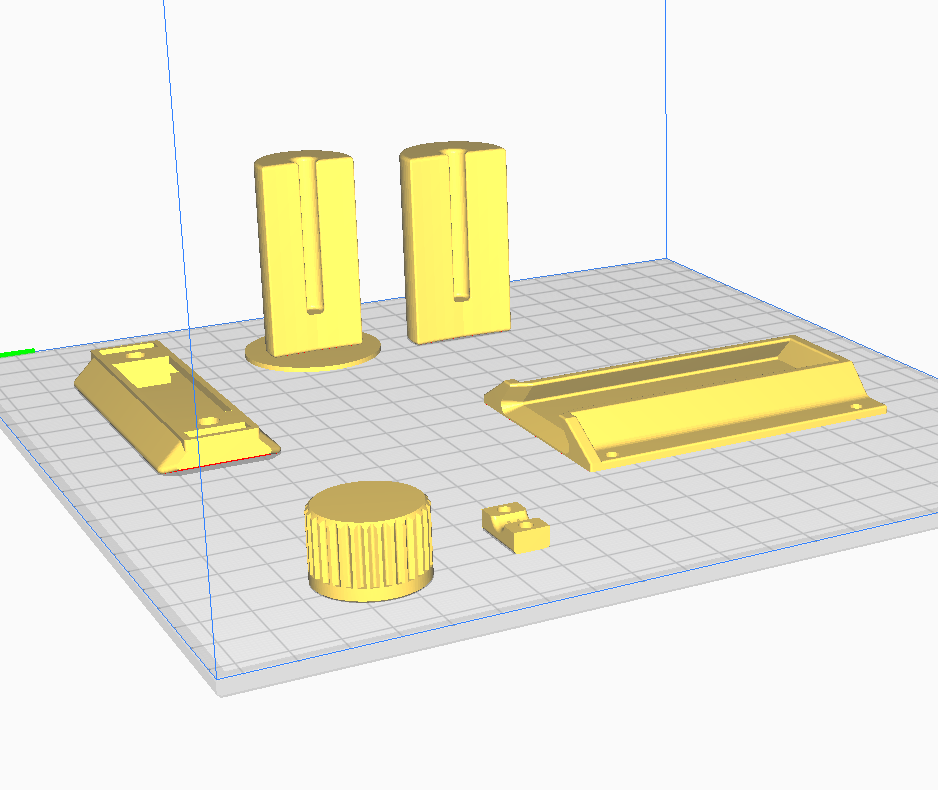

# Spundomat

Stand: 01.2022

**Spunden & Karbonisieren:**

Das Projekt Spundomat ist aus dem Hobbybrauer Forum entstanden. Der Grundgedanke für den Spundomat liegt in der Automatisierung von wiederkehrenden Aufgaben beim Brauen.

**Spunden** <https://hobbybrauer.de/forum/wiki/doku.php/lagern:spunden>

*Unter dem Spunden versteht man Bier in einem druckdicht abgeschlossenen Faß oder Gärbehälter
kontrolliert zu Carbonisieren damit Kohlendioxid im Bier gelöst wird. Um eine Explosion des Druckfasses zu vermeiden und einen erwünschten Kohlensäuregehalt des Bieres laut Spundungstabelle zu erreichen muss ein einstellbares Druckbegrenzungsventil,
das Spundventil (Spunddruckregler) am Fass angebracht werden. Bei der Spundung muss keine genaue Menge an Zucker oder Würze zugegeben und berechnet werden, weil das Spundventil überschüssiges CO2 automatisch ablässt. Am einfachsten schlaucht man nach 5-7 Tagen in die Drucktanks oder Kegs und hängt das nach Tanktemperatur (bzw. Raumtemperatur wenn nicht temperaturreguliert) richtig eingestellte Spundventil an.*

**Karbonisieren** <https://hobbybrauer.de/forum/wiki/doku.php/carbonisieren>

*Unter Karbonisieren oder Aufkarbonisieren versteht man das Einbringen einer bestimmten Menge an Kohlendioxid im Bier. Dabei kann man das CO2 natürlich im Rahmen einer Nachgärung durch Nachwürzen erzeugen, oder von aussen mit einer CO2-Gasflasche und Druckminderer zuführen (Zwangscarbonisieren). Jeder Bierstil hat seinen eigenen typischen Bereich für den im Bier gelösten Kohlendioxidgehalt. Eine Tabelle findet man hier.
Zwangskarbonisieren: Das in einem druckfesten Behälter (Fass, Keg) befindliche nicht mehr gärende Bier mit dem der Temperatur entsprechenden CO2-Druck beaufschlagen und die geöffnete CO2-Flasche so lange dran lassen, bis sich die Manometeranzeige nicht mehr verändert.*

**Was ist Spundomat?**

Der Spundomat automatisiert das Spunden und das Karbonisieren. Zur Automatisierung werden ein Druck- und ein Temperatursensor sowie zwei Magnetventile eingesetzt. Die Firmware öffnet bzw. schließt die Magnetventile automatisch anhand der Daten vom Druck- und Temperatursensor. Der Spundomat bietet eine Kombination aus Spunden und Karbonisieren.

**Was bietet diese Firmware?**

Die Firmware bietet vier Betriebsmodis:

1. Spunden (Druck ausgehend vom Keg)
2. Karbonisieren (CO2 eingehend in das Keg)
3. Spundomat: die Kombination aus Spunden und Karbonisieren
4. Ablaufpläne (bspw. schnelles Zwangskarbonisieren und CO2-Wäsche)

Zur Konfiguration und Verwendung kann ein Display mit Encoder (Dreh-Drück-Knopf) oder das Web Interface verwendet werden.

* Web Interface (WebIf) für die Konfiguration
* 2004A Display Integration
* Encoder Unterstützung
* Sensoren
  * Temperatursensoren DS18B20
  * Drucksensor
* Magnetventil MV1 ausgehend (Spunden)
* Magnetventil MV2 eingehend (Karbonisieren)
* Drucksensor Kalibrierung
* mDNS Support
* Backup / Restore der Konfiguration (config.json) über Dateiexplorer
* Firmware WebUpdate
* Firmware Datei Update über WebIf (Firmware und LittleFS)

Dieses Projekt wurde im Hobbybrauer Forum gestartet und dient dem Informationsaustausch.

---

## Installation

**Installation ohne den Quellcode zu compilieren:**

Mit Hilfe von esptool.exe (<https://github.com/igrr/esptool-ck/releases>) aus dem Ordner tools kann die Firmware auf das ESP Modul geladen werden. Das ESPTool ist für verschiedene Betriebssysteme verfügbar.
ESPtool-ck Copyright (C) 2014 Christian Klippel <ck@atelier-klippel.de>. This code is licensed under GPL v2.

Unter Win10 wird der USB Treiber CH341SER benötigt: <http://www.wch.cn/download/CH341SER_ZIP.html>

Beispiel für ein ESP8266 Modul vom Typ Wemos D1 mini mit 4MB Flash verbunden mit COM3:

* Von github das Archiv Firmware aus dem Ordner Tools herunterladen und irgendeinem Ordner entpacken

  * Das Archiv enthält das esptool zum Flashen, das Skript Flashen.cmd und die zwei Firmware Dateien

  * Doppelklick auf die Datei Flashen.cmd.

  Sollte COM3 nicht der richtige Anschluss sein, muss im Skript Flashen.cmd an zwei Stellen COM3 durch den richtigen Anschluss ersetzt werden.

  * Das ESP8266 Modul resetten

  * Das ESP8266 Modul startet anschließend im Access Point Modus mit der IP Adresse 192.168.4.1

  * Das ESP8266 Modul über einen Webbrowser mit dem WLAN verbinden

  * Anschließend ist der Spundomat erreichbar über <http://spundomat>
    je nach Netzwerkumgebung kann es 20-30 Sekunden dauern, bis der mDNS Name aufgelöst wird

**Updates:**

Die Firmware bietet zwei Möglichkeiten, um Updates sehr einfach einspielen zu können.

1. Update durch Dateiupload

    Im Webbrowser die URL <http://spundomat/update> aufrufen oder über die Funktion "Update".
    Hier kann Firmware und das Filesystem SPIFFS aktualisiert werden. Wenn das Filesystem SPIFFS mit Dateiupload aktualisiert wird, wird die Konfigurationsdatei überschrieben. Siehe hierzu auch Backup und Restore.

2. WebUpdate

    Im Webbrowser die URL <http://spundomat> aufrufen und die Funktion "Update" aufrufen.
    WebUpdate aktualisiert die Firmware, die index Datei und Zertifikate. Durch WebUpdate wird die Konfigurationsdatei nicht überschrieben.

**Backup and Restore der Konfiguration:**

Der Dateiexplorer ist erreichbar über den Webbrowser <http://spundomat/edit>

1. Backup

    Auf die Datei config.txt klicken und aus dem PopUp Download auswählen.

2. Restore

    Auf "Datei auswählen" klicken, die config.txt auswählen und Upload auswählen.

**mDNS:**

Ein mDNS Name kann anstelle der IP Adresse vom ESP8266 im Webbrowser verwendet werden (<http://mDNSname>). Der Name ist frei wählbar. Der mDNS Name muss im Netzwerk eindeutig sein und darf keine Leer- oder Sonderzeichen enthalten.

---

## Das Dashboard

Das Dashboard vom Spundomat ist das Web Interface. Hier werden alle Informationen zum Spundomat übersichtlich dargestellt.
Auch auf dem LCD Dispaly werden alle benötigten Informationen abhängig vom Betriebsmodus dargestellt. Auf dem LCD Display werden zusätzlich Informationen über das WLAN und die aktuelle IP Adresse angezeigt. Auf dem LCD Display können nicht alle Konfirguationseinstellungen angezeigt werden, daher hat das LCD Display primär die Aufgabe im Betrieb eine schnelle Übersicht zu liefern.

---

## Grundeinrichtung

Über das Web Interface ist eine Grundeinrichtung vorzunehmen. Hierunter fällt das Aktivieren der verwendeten Magnetventile und die Kalibrierung. Über den Button "Einstellungen" können die Grundeinstellungen von Spundomat konfiguriert werden.

**Aktivieren der Magnetventile:**

Im Tab Hardware können das Magnetventil 1 (Spunden) und das Magnetventil 2 (Karbonisieren) aktiviert werden. Zu beiden Magnetventilen können die Standardzeiten für das Öffnen und Schließen in Millisekunden konfiguriert werden. In der Grundeinstellung sind 200ms für das Öffnen und 10000ms für das Schließen der Magnetventile vorgegeben.

Beispiel:
der Spundomat wird im Modus "Spunden CO2 Gehalt" betrieben. In den Einstellungen ist das Magnetventil MV1 aktiviert. Der Parameter "Öffne MV1" ist mit 200ms und "Schließe MV1" mit 10000ms konfiguriert. Dieser Modus wird bevorzugt eingesetzt, wenn mit Speise oder Zucker im Jungbier natürliches CO2 gebunden werden soll. Steigt der Druck im Keg über den vorgegebenen CO2 Gehalt, öffnet das Magnetventil 1 zum Spunden für 200ms. Druck entweicht aus dem Keg. Anschließend bleibt das Magnetventil 1 für 10000ms oder 10 Sekunden geschlossen.

**Kalibrierung:**

Der Drucksensor vom Spundomat muss vor seiner ersten Verwendung kalibriert werden. Weil es unterschiedliche Drucksensoren und geringfügige Abweichungen bei der Spannungsversorgung gibt, ist eine Kalibrierung notwendig. Der Spundomat funktioniert bereits mit nur einer Kalibrierung bei 0bar. Es wird eine 2-Punkte Kalibrierung empfohlen.

Vorgehensweise Kalibrierung:

Das komplette System muss drucklos sein. Eine CO2 Flasche, ein Keg oder Rückschlagventile sind vom Drucksensor zu trennen. Die Kalibrierung misst die Spannung am analogen Port des Wemos D1 mini bei 0.0bar. Diese Spannung (Offset) wird im Eeprom des Wemos gespeichert und wird bei der Berechung Druck verwendet.

Eine 2. Kalibrierung bei 2.0bar vorgenommen. Hierfür wird ein leeres Keg mit 2.0bar befüllt. Wenn das Keg möglichst genau mit 2.0bar befüllt ist, wird der Spundomat angeschlossen. Zu beachten ist, dass der Druck von 2.0bar mit einem Manometer gemessen werden muss und nicht über den Spundomat! Wenn die Funktion "Kalibrierung" nun erneut ausgeführt wird, speichert die Firmware den 2. Offset-Wert für 2.0bar im Eeprom des Wemos ab.

Die Kalibrierung kann jederzeit über die Grundeinstellungen -> Restore - > Kalibrierung löschen entfernt werden.

**Piezo Buzzer:**

Optional kann ein Piezzo Buzzer aktiviert werden. Die Firmware bietet verschiedene Signaltöne.

**mDNS aktivieren:**

mDNS ist eine einfache Möglichkeit, um den Spundomat mit einem beliebigen Namen anzusprechen. In der Standardkonfiguration ist der Spundomat im Webbrowser über <http://spundomat> erreichbar. In den Grundeinstellungen im Tab System kann mDNS aktiviert und konfiguriert werden. Zu beachten gilt, dass mDNS Namen im Netzwerk eindeutig sein müssen.

**Zeitintervalle für Sensoren:**

Ebenfalls in den Grundeinstellungen im Tab System können die Zeitintervall zum Datenabruf der Sensoren Druck und Temperatur konfiguriert werden. Der Abruf vom Temperatursensor ist als kontinuierlicher Task (Ticker) in der Firmware implementiert. Standardwert ist alle 30 Sekunden. Bitte beachten: die Eingabe ist in ms.

Das Zeitintervall für das Lesen vom Drucksensor ist lediglich eine Grundeinstellung. Je nach Anforderung und Betriebsmodus werden Daten bei Bedarf und nicht nach Ablauf eines Zeitintervalls abgefragt. In Ablaufplänen wird das Abfrageintervall für den Durcksensor deaktiviert und nach den konfigurierten Zeiten für das Öffenen und Schließen der Magnetventile der Durcksensor abgefragt. Der Standardwert lautet 1000ms. Bitte beachten: die Eingabe ist in ms.

**Grafana:**

Der Spundomat unterstützt die Visualisierung mit der OpenSource Software Grafana. Die Visualisierung ist optional und für den normalen Betrieb nicht erforderlich. Der Spundomat schreibt direkt in die Datenbank InfluxDB. Es wird aktuell nur die lokale Installation unterstützt. Folgende Parameter sind erforderlich:

* Influx Datenbank Server: <http://raspberrypi_IP:8086>

  Die URL besteht aus der IP Adresse vom RaspberryPI und dem Port getrennt durch ein Doppelpunkt besteht. Der Standard-Port ist 8086.
* Datenbank (Bucket) Name: hier muss der Name der Datenbank in Influx eingetragen werden. Standard: spundomat (siehe Installation und Konfiguration Datenbank)
* Benutzername und Password (optional - siehe Installation und Konfiguration Datenbank)
* Update Intervall: Zeitintervall in Minuten. Default: 60 Sekunden

  Das Update Intervall gibt an, wie häufig der Spundomat seine Sensordaten in die Datenbank schreibt.

Wenn die Option Grafana erstmalig aktiviert wird, muss der Spundomat einmal neu gestartet werden.

**Restore:**

Das Menü für die Grundeinstellung bietet Funktionen, um Einstellungen und KOnfigurationen vom Wemos D1 mini zu löschen. Zur Auswahl stehen

* lösche Kalibrierung. Hiermit werden die im Eeprom gespeicherten Offsets gelöscht.
* Lösche WiFi
* Reset to defaults (Lösche WiFi, lösche Kalibrierung aus dem Eeprom und lösche die Spundomat Konfigruation)

---

## Der Spundomat im Betrieb

Über den Button "Bearbeiten" kann der Betriebsmodus für den Spundomat ausgewählt werden. Es wird zwischen zwei Betriebsmodis unterschieden:

* Spunden
* Karbonisieren

**Spunden:**

Der Betriebsmodus Spunden ist für Brauer geeignet, die mit Speise, Zucker oder Grünschlauchen für eine Nachgärung im Keg arbeiten. Im Modus "Spunden CO2-Gehalt" wird auf Basis der gemessenen Temperatur und dem eingestellten Zielwert CO2-Gehalt in Gramm pro Liter der erforderliche Druck im Keg berechnet. Das Spunden CO2-Gehalt ist ein automatisiertes Ablassen von Druck aus dem Keg oberhalb des Drucks für den gewünschten CO2-Gehalt. Ändert sich die Temperatur während der Nachgärung oder Reifung ermittelt der Spundomat automatisch den korrekten Druck.

Ein eher seltener genutzer Modus ist das Spunden auf Basis Druck in bar. Der Prozess Druck ablassen basiert in diesem Modus auf dem gemessenen Wert vom Drucksensor.

**Karbonisieren:**

Der Betriebsmodus Karbonisieren ist für Brauer geeignet, die ein endvergorenes Jungbier ins Keg schlauchen und das Keg mit CO2 auf einen gewünschten CO2-Gehalt beaufschlagen. Ohne den Spundomat wird der benötigte Druck aus einer Tabelle in Abhängigkeit von der Temperatur ermittelt. Der Spundomat ermittelt den benötigten Druck automatisch und führt CO2 in das Keg. Ändert sich die Temperatur während der Lagerung oder Reifung ermittelt der Spundomat automatisch den korrekten Druck.

Ebenfalls ein eher seltener genutzer Modus ist das Karbonisieren auf Basis Druck in bar. Der Prozess Karbonisieren basiert in diesem Modus auf dem gemessenen Wert vom Drucksensor.

**Der Spundomat Modus:**

Der Modus Spundomat fügt die zwei Betriebsmodis Spunden und Karbonisieren auf Basis CO2-Gehalt zusammen. Dieser Modus basiert auf dem Zielwert CO2-Gehalt. Druck im Keg oberhalb wird automatisch abgelassen. Druck unterhalb führt automatisch zum Zuführen von CO2. Dieser Modus ermittelt während der Nachgärung und Reifung Temperaturänderung und berechnet den erforderlichen Druck im Keg neu.

Besonderheit im Modus Spundomat:

Sobald der Spundomat den Zieldruck für den berechneten CO2-Gehalt erreicht hat, werden die Zeitintervalle für beide Magnetventile automatisch angepasst. Die Magnetventile öffnen für 10ms und schließen für mindestens 10 Sekunden. Diese Automatik verhindert unnötigen CO2 Verbrauch durch ständiges Spunden und Karboniseren rund um den Zielwert, wenn zu lange Öffnungsintervalle konfiguriert wurden.

Zusätzlich bietet die Firmware eine Verzögerung für die Karbonisierung. In einfachen Worten: starte die Nachgärung im Keg und baue Druck langsam auf. Nach einer einstellabren Zeit bspw. nach 2-3 Tagen oder ab einem durch Nachgärung aufgebautem CO2-Gehalt von bspw 3 gr/l starte die Karbonisierung.

Für eine Verzögerung der Karbonisierung kann als Parameter die Zeit (in Minuten oder Stunden) oder ein Mindest-CO2 Gehalt gennutzt werden. Beide Verzögerungen für die Karbonisierung bieten der Hefe Zeit für die Nachgärung. Die Verzögerung wird meist dann angewendet, wenn sehr früh im Gärungsprozess geschlaucht werden soll.

**Zeitintervalle für die Magnetventile:**

Alle Betriebsmodis haben gemeinsam, dass die einstellbaren Zeitintervalle darüber entscheiden, ob der Spundomat sehr schnell oder sehr träge auf Druckänderung reagiert. Grundsätzlich ist der Prozess Nachgärung und Reifung ein über viele Tage laufender Prozess. Eine Druckänderung im Keg wird sich ebenfalls über viele Stunden und Tage herstellen und nicht binnen Sekunden oder Minuten. Dementsprechend ist ein permantes schnelles Öffnen und Schließen der Ventile nicht notwendig.

Für jedes Magnetventil wird ein Zeitintervall Öffnen und ein Zeitintervall Schließen konfiguriert. Die Zeitangabe ist in Millisekunden. Während der Nachgärung und Reifung sind beispielhaft folgende Zeitintervalle geeignet:

* Öffne Magnetventil 1 (Spunden) für 200ms, wenn der vorhandene Druck über dem Zieldruck liegt
* Schließe nach dem Öffnen Magnetventil 1 für 360000ms (1 Minute)

Diese Zeitintervalle bewirken nun, dass bei überschüssigen Druck im Keg 1x pro Minute für 300ms Druck abgelassen wird. Während das Ventil geschlossen ist, wird der aktuelle Druck am Sensor abgelesen. Ist weiterhin überschüssiger Druck vorhanden, wiederholt sich das Öffnen für 300ms und das Schließen für 1 Minute. Ist der Druck geringer oder gleich dem Zielwert, öffnet sich Ventil 1 nicht.

Im Modus Spundomat wechseln sich Magnetventil 1 (Spunden) und Magnetventil 2 (Karbonisieren) ab. Es beginnt Magnetventil 1 mit der Überprüfung, ob überschüssiger Druck vorliegt. Falls ja findet der oben beschriebene Prozess Spunden Öffnen-Schließen statt. Anschließend prüft Magnetventil 2, ob zu geringer Druck vorliegt. Falls ja findet wieder der oben beschriebene Prozess Karbonisieren Öffnen-Schließen statt, aber dieses Mal am Magnetventil 2 vor der CO2-Flasche.
Die Zeitintervalle, insbesondere die Werte für Magnetventile geschlossen, entscheiden nun über die Häufigkeit der Überprüfung.

Bitte beachten: wenn ein 19l Keg mit 18,5l Jungbier befüllt ist und ein Druck von ca. 1bar im Keg herrscht, entsteht automatisch eine Schaumbildung, wenn das Magnetventil 1 Spunden für längere Zeit (über 500ms) geöffnet wird. Nachgärung und Reifung benötigt Zeit und Ruhe. Dementsprechend sind kurze Zeitintervalle für das Öffnen und lange Zeitintervalle für das Schließen der Magnetventile zu bevorzugen.

**Der Modus Überprüfe Dichtheit:**

Im Modus Überprüfe Dichtheit kann das System wie der Name vermuten lässt auf Dichtheit überprüft werden. Bei NC/CC Kegs sind die Deckel sehr häufig undicht. Meist schließt sich die undichte Stelle bei höherem Druck im Keg. Die NC/CC Anschlüsse für die CO2 und Bierleitungen sind ebenfalls sehr häufig undicht. Hier ist es im Gegensatz zum Keg Deckel eher umgedreht: bei höherem Druck tritt Undichtheit auf. Das pneumatische Stecksystem birgt ebenfalls die Gefahr, dass bei einem schnellen Aufbau eine Verbindung nicht korrekt eingesteckt wird. Der Modus Überprüfe Dichtheit kann und sollte vor jedem Spundomat Einsatz durchgeführt werden.

Der Modus Überprüfe Dichtheit überprüft die Druckänderung nach einem Zeitintervall von 5 Minuten. Wenn zum Zeitpunkt 0 (null) im Keg ein Druck von 1,025bar herrscht und 5 Minuten später wird ein Druck von 0.995bar gemessen, dann lautet das Ergebnis der Überprüfung Dichtheit 0,03bar. Dieser Wert wird nicht gespeichert. Nach einem Neustart des Spundomaten wird im Dashboard immer "Dichtheit nicht überprüft" angezeigt.

Ein positiver Wert als Ergebnis der Überprüfung Dichtheit ist als Druckverlust zu bewerten. Es liegt eine Undichtheit vor.

Ein negativer Wert als Ergebnis ist als Druckzunahme zu bewerten. Eine Druckzunahme basiert in den meisten Fällen auf eine Ändeurng der Temperatur im Keg bzw. im gesamten Drucksystem.

Um mit diesen Modus die Dichtheit zu überprüfen, müssen die folgenden Vorbereitungen abgeschlossen sein:

* das Keg und Spundomat sollten min. 15 Minuten in der Umgebungstemperatur gestanden haben
* in den Einstellungen wird der "Zielwert Druck" auf einen Wert von 1bar oder höher eingestellt

Nun kann der Modus "Überprüfe Dichtheit" ausgewählt werden. Das Keg wird mit dem konfiguriertem Druck befüllt. Sobald dieser Druck erreicht ist, wartet der Spundomat 2 Minuten ab. Nach 2 Minuten wird der aktuelle Druck (#1) gemessen. Nach einer weiteren Wartezeit von 5 Minuten wird ein zweites Mal der Druck (#2) gemessen. Das Delta, also die Differenz der beiden Druckmessungen (Delta = #2 - #1) wechselt der Spundomat automatisch den Modus auf "Aus" und zeigt im Dashboard das Delta an.

---

## Ablaufpläne

Die Firmware bietet die Möglichkeit drei unterschiedliche Ablaufpläne zu nutzen.

**Was sind Ablaufpläne?**

Ein Ablaufplan ist eine automatisierte zeitliche Abfolge von Öffnen und Schließen der zwei Magnetventile. Beispielhaft sind die Ablaufpläne beigefügt

* P1 QuickCarb
* P2 CO2Wäsche
* P3 Keg Entlüften

Alle Ablaufpläne müssen auf die individuelle Umgebung und Anforderungen angepasst werden!

*Wichtiger Hinweis:*

In den Ablaufplänen können Intervalle für das Öffnen und Schließen der Magnetventile frei definiert werden. Wenn bei hohem Druck im Keg das Magnetventil 1 (Spunden) für längere Zeit (über 300ms) geöffnet UND anschließend nur kurz (unter 3000ms) geschlossen wird, entsteht zwangsläufig Schaum im Keg. Dies kann zur Folge haben, dass Flüssigkeit in die Leitungen eintreten kann. Hohen Druck aus dem Keg Spunden benötigt Zeit und Ruhephasen. Anderfalls kann Bierschaum in den Spundomat eintreten.

**Unterschied Betriebmodis vs. Ablaufplan:**

Ein Betriebsmodus wie bspw. der Spundomat Modus läuft bis zum manuellen Beenden mit konstanten Parametern für Zieldruck bzw. den Ziel-CO2-Gehalt und Intervallen der Magnetventile.
Ein Ablaufplan hat bis zu 20 Wiederholungen und kann in jeder Wiederholung mit anderen Parameter Druck und Zeitintervalle durchgeführt werden.

Ablaufpläne sollen definierte Aufgaben durchführen. Betriebmodis sollen über einen längeren Zeitraum bspw. 2-4 Wochen die Nachgärung / Reifung und damit den CO2-Gehalt im Jungbier kontrolliert auf den gewünschten CO2-Gehalt bringen. Im Idealfall ohne regelmäßige Eingriffe durch den Hobbybrauer.

**Aufbau der Ablaufpläne:**

Ablaufpläne werden über das WebIf definiert.

Ein Ablaufplan beginnt mit einer Namensgebung. Im Bild hat der Ablaufplan den Namen "P1 QuickCarb"

In den darauffolgenden Zeilen und Spalten werden nun der Druck und die Zeitintervalle für das Öffnen und Schließen der zwei Magnetventile festgelegt.
Ein Ablaufplan kann bis zu 20 Schritte enthalten. Jeder Schritt ist ein Sequenz aus

* Lasse über Magnetventil 1 Druck aus dem Keg ab
* Fülle CO2 über das Megnetventil 2 in das Keg

---

## Die Spundomat Platine

**Wichtiger Hinweis:**

Die Platine ist aus einem Hobby-Projekt entstanden. Eine fertig bestückte Platine wird nicht angeboten. Das Projekt verfolgt keinerlei kommerzielle Absichten. Die hier geteilten Informationen stellen einen Entwicklungszustand dar und dienen der Weiterentwicklung sowie der Überprüfung, Korrektur und Verbesserung. Inhalte aus externen Links (bspw. Forum hobbybrauer) und Angaben zu externen Inhalten (bspw. Artikel verschiedener Anbieter) unterliegen den jeweiligen Rechten der Inhaber. Externe Inhalte sind ausschließlich als informative Starthilfe anzusehen.

*Alle Informationen über die Platine sind rein informativ und können falsch sein. Verwendung dieser Informationen auf eigene Gefahr. Jegliche Haftung wird ausgeschlossen.*

In diesem Projekt wurde eine Platine für den Spundomat entwickelt, um mit Klemmschraubblöcken eine einfache Anbindung an Sensoren und Magnetventile zu bieten. Die Platine ist mit wenigen elektronsichen Bauteilen bestückt. Der Aufbau erfordert ein Grundwissen und Grundkenntnisse im Bereich der Elektrotechnik.
Die Platine bietet folgende Vorteile:

* der Wemos D1 mini steckt auf einem Sockel und kann jederzeit abgenommen werden.
* die Stromversorgung vom Wemos wird über ein Netzteil 12V/2A und einem Spannungsregler LM 2575T-5G hergestellt.
* Sensoren, Display, Encoder und Magnetventile können direkt an die Schraubklemmen angeschlossen werden.
* LEDs für beide Magnetventile
* Piezzo Buzzer

Die Pinbelegung am Wemos D1 mini

* Drucksensor     A0
* Buzzer          D7
* DS18B20         D3
* ENCODER A       D6 CLK Out A
* ENCODER B       D5 DT Out B
* ENCODER BUTTON  D4
* Magnetventil 1  D8 Spunden
* Magnetventil 2  D0 Karbonisieren
* Display SCL     D1
* Display SDA     D2

Beschreibung:

**Elektronikbautteilliste:**

*Lieferanten und Hersteller wie bspw. amazon, ebay, fittingline oder reichelt sowie die Links zu deren Produkten sind rein informativ als Suchhilfe für allgemein bekannter Anbieter zu verstehen!*

Zusammenstellung: <https://www.reichelt.de/my/1696058>

| Anzahl | Artikel | Link |
| ------ | ------- | ---- |
|5 | Widerstand 1 k | [reichelt](<https://www.reichelt.de/widerstand-metallschicht-1-00-kohm-0207-0-6-w-1-metall-1-00k-p11403.html?&nbc=1>) |
|1 | Widerstand 4 k7 | [reichelt](<https://www.reichelt.de/widerstand-metallschicht-4-7-kohm-0207-0-6-w-1-k-o-sfcn4701t52-p237245.html?&trstct=pos_0&nbc=1>) |
|4 | Widerstand  10 k | [reichelt](<https://www.reichelt.de/widerstand-metallschicht-10-0-kohm-0207-0-6-w-1-metall-10-0k-p11449.html?&nbc=1>) |
|1 | Widerstand  150 k | [reichelt](<https://www.reichelt.de/widerstand-metallschicht-150-kohm-0207-0-6-w-1-k-o-sfcn1503t52-p237322.html?&nbc=1>) |
|1 | Diode  1N 5819 | [reichelt](<https://www.reichelt.de/schottkydiode-40-v-1-a-do-41-1n-5819-p41850.html?&nbc=1>) |
|2 | Dioden  1N 4004 | [reichelt](<https://www.reichelt.de/gleichrichterdiode-400-v-1-a-do-41-1n-4004-p1726.html?&trstct=pos_0&nbc=1>) |
|1 | LED 5mm rot | [reichelt](<https://www.reichelt.de/led-5-mm-bedrahtet-rot-1800-mcd-30-l-7113srd-j4-kb-p219690.html?&nbc=1>) |
|1 | LED 5 mm blau | [reichelt](<https://www.reichelt.de/led-5-mm-bedrahtet-blau-800-mcd-60-led-5mm-bl-p61102.html?r=1>) |
|1 | Transistor BC 547 A | [reichelt](<https://www.reichelt.de/bipolartransistor-npn-45v-0-1a-0-5w-to-92-bc-547a-p219128.html?&nbc=1>) |
|2 | Optokoppler EL 817 | [reichelt](<https://www.reichelt.de/optokoppler-5kv-35v-50ma-50-dip4-el-817-p146657.html?&nbc=1>) |
|2 | MosFet IRFIZ 24 N | [reichelt](<https://www.reichelt.de/mosfet-n-ch-55v-14a-29w-to-220-fullpak-irfiz-24n-p90327.html?&nbc=1>) |
|1 | Elko 100 uF/ 16V stehend | [reichelt](<https://www.reichelt.de/elko-100-f-16-v-105-c-rad-lxz-16-100-p166363.html?&trstct=pos_0&nbc=1>) |
|1 | Drossel 33uH    FAS 09HCP-331K-5 | [reichelt](<https://www.reichelt.de/power-induktivitaet-radial-330-h-fas-09hcp-331k-5-p245783.html?&nbc=1>) |
|1 | Schaltregler   LM 2575T-5G | [reichelt](<https://www.reichelt.de/index.html?ACTION=446&LA=446&nbc=1&q=lm2575t-5g>) |
|3 | Klemmblöcke 2- polig RM5,08 | [reichelt](<https://www.reichelt.de/loetbare-schraubklemme-2-pol-rm-5-08-mm-90-rnd-205-00287-p170288.html?&nbc=1>) |
|2 | Klemmblöcke 3- polig RM 3,81 | [reichelt](<https://www.reichelt.de/anschlussklemme-3-pol-1-5-mm-rm-3-81-akl-086-03-p72034.html?&nbc=1>) |
|1 | Klemmblock  5- polig RM 2,54 | [reichelt](<https://www.reichelt.de/leiterplattenklemme-5-polig-rm-2-54-mm-dg308-2-54-5-p276217.html?&GROUP=C1F3&START=0&SORT=artnr&OFFSET=16&nbc=1>) |
|1 | Klemmblock  4- polig RM 2,54 | [reichelt](<https://www.reichelt.de/leiterplattenklemme-4-polig-rm-2-54-mm-dg308-2-54-4-p276216.html?&GROUP=C1F3&START=0&SORT=artnr&OFFSET=16&nbc=1>) |
|1 | Piezosummer KPE 232A | [reichelt](<https://www.reichelt.de/piezosummer-summer-kpe-232a-p35920.html?&nbc=1>) |
|1 | XLR Buchse 3- polig | [reichelt](<https://www.reichelt.de/xlr-einbaubuchse-3-polig-mit-verriegelung-xlr-3eb-p22899.html?&nbc=1>) |
|1 | XLR Stecker 3- polig | [reichelt](<https://www.reichelt.de/xlr-stecker-3-polig-vernickelte-kontakte-xlr-3st-n-p40793.html?&nbc=1>) |
|1 | Schalter | [reichelt](<https://www.reichelt.de/wippschalter-1x-aus-schwarz-i-o-wippe-1801-1146-p36770.html?&nbc=1>) |
|1 | Encoder  KY 040 | [reichelt](<https://www.ebay.de/itm/Potentiometer-Drehregler-KY-040-Rotary-Encoder-Drehgeber-Taster-Poti-Arduino/254138168087?hash=item3b2bd0b317:g:p9oAAOSw94NccoFi>) |
|1 | Wemos D1 mini |
|1 | Steckernetzteil 12V / 2A |
|1 | Drucksensor  0- 0,5 Mpa /1/4" | [ebay](<https://www.ebay.at/itm/G1-4-OLDRUCKSENSOR-Drucksensor-0-0-5-MPa-Fur-Oil-Fuel-Diesel-Gas-Wasser-Luft/371961467626?hash=item569aa192ea:g:SMEAAOSwlY1ZFbm~>) |
|1 | DS 18B20 Temperatursensor |
|1 | LCD Display 2004 |
|2 | Magnetventile 12 V -1/4" | [ebay](<https://www.ebay.at/itm/1-4-Pneumatik-Magnetventil-12V-DC-Electric-Solenoid-Valve-fur-Wasser-Luft-s0d/123512299808?hash=item1cc1e82120:g:zNEAAOSwMhVb~BfR>) |
|4 | Distanzhülsen | [ebay](<https://www.reichelt.de/distanzhuelsen-metall-6-kant-m3-15mm-da-15mm-p7018.html?&nbc=1>) |

**Pneumatikkomponenten:**

| Anzahl | Artikel | Link |
| ------ | ------- | ---- |
| 1 | Schalldämpfer 1/4" |  [landefeld](<https://www.landefeld.de/artikel/de/schalldaempfer-g-14-sinterbronze/SD%2014>) |
| 1 | Rückschlagventil 6mm-1/4" | [landefeld](<https://www.landefeld.de/artikel/de/rueckschlagventil-r-14-6mm-durchfluss-vom-gewinde-zum-schlauch-iqs-standard/HAIQS%20146>) |
| 2 | Steckanschlüsse 6mm -1/8" | [landefeld](<https://www.landefeld.de/artikel/de/gerader-steckanschluss-g-18-6mm-iqs-standard/IQSG%20186%20G>) |
| 3 | Steckanschlüsse 6mm -1/4" | [landefeld](<https://www.landefeld.de/artikel/de/gerader-steckanschluss-g-14-6mm-iqs-standard/IQSG%20146%20G>) |
| 1 | Verteilerblock 2x 1/4" -2x 1/8" | [landefeld](<https://www.landefeld.de/artikel/de/verteilerleiste-2-x-g-14-2-x-g-18-aluminium-eloxiert/RLE2%201418%20A>) |
| 1 | Y-Steckverbinder 8-6mm | [landefeld](<https://www.landefeld.de/artikel/de/y-steckanschluss-8mm-6mm-iqs-standard/IQSY%208060>) |
| 1 | Rückschlagventil 6 mm | [landefeld](<https://www.landefeld.de/artikel/de/steckanschluss-rueckschlagventil-6mm-iqs-standard/HIQS%2060>) |
| 1 | Rückschlagventil 8mm | [landefeld](<https://www.landefeld.de/cgi/main.cgi?DISPLAY=suche&filter_suche_artikelmenge=&filter_suche_suchstring=HIQS80>) |
| 1 |  Schlauch 6 mm ca. 2 mt | [landefeld](<https://www.landefeld.de/artikel/de/polyurethan-schlauch-6-x-4-mm-silber/PUN%206X4%20SILBER>) |
| 1 | Schlauch 8 mm ca. 1 mt | [landefeld](<https://www.landefeld.de/artikel/de/polyurethan-schlauch-8-x-5-mm-schwarz/PUN%208X5%20SCHWARZ>) |

**Aufbau:**

Grundsätzlich können für das LCD- Display, Encoder, Sensoren sowohl Klemmblöcke mit RM 2,54 als auch PSK-Platinen-Steckverbinder verwendet werden.

<https://www.reichelt.de/kupplungs-leergehaeuse-crimptechnik-2-polig-psk-254-2w-p14857.html?&nbc=1&trstct=lsbght_sldr::14861>
<!-- -->
<https://www.reichelt.de/printstecker-einzelstecker-gerade-5-polig-pss-254-5g-p14911.html?&nbc=1>
<!-- -->
Allerdings benötigt man dafür eine spezielle Crimpzange.

Vorgehensweise Aufbau der Platine:

1. einlöten der beiden Brücken (auf der Platine markiert)
2. Platine mit allen Widerstände bestücken
3. Platine mit allen Dioden, LEDs gem. Aufdruck bestücken
4. restliche Bauteile einlöten
5. zuletzt werden die zwei MosFet und der Schaltregler LM 2575T-5G eingelöten
  -> die Anschlussdrähte MosFet max. 10mm, weil sonst die Bauteile über den Gehäuserand ragen
6. Steckleisten für den Wemos bestücken
  -> am Wemos werden die Buchsenleisten verwendet
7. nun alle Klemmblöcke (oder Steckverbinder) bestücken
  -> die blauen Pfeile markieren die PSK-Steckverbinder
8. Der Anschluss für ein TFT muss aktuell nicht bestückt werden (optional)
  -> der Anschluss LCD wird benötigt
9. der Piezo -Summer wird an der Platinenunterseite auf die beiden Pins aufgelötet - Vorsicht Polarität!
  -> violetter Pfeil ist der Pluspol

Die Montage des LCD-Displays, der Platine und des Encoders erfolgt in dieser Reihenfolge

1. zuerst das Display mit 4 Distanzhülsen (M3 x 15) am Gehäuse verschrauben
  <https://www.reichelt.de/distanzhuelsen-metall-6-kant-m3-15mm-da-15mm-p7018.html?&nbc=1>
2. mit Distanzhülsen oder M3 x 6 bis 8mm Schrauben die Platine befestigen
3. zuletzt den Encoder mit M2,5 x 6 mm Schrauben befestigen (beim Encoder passen keine M3 Schrauben)

Die Verkabelung kann mit Flachbandlitzen durchgeführt werden.

**Hardware: Anschlussmöglichkeiten Drucksensor und Magnetventil:**

Im Spundomatgehäuse wird grundsätzlich die Schlauchdimension 6 x 4 mm verwendet (weichere PU-Qualität)

1. am Magnetventil 2 (Karbonisierer) muss der elektrische Spulenkopf um 180° gedreht werden
  -> dazu Mutter etwas lösen, anheben und drehen und die Mutter wieder festschrauben
2. zuerst an allen Bauteilen (Magnetventile , Verteilerblock) die entsprechenden Fittinge einschrauben
  -> Wichtig: der Drucksensor muss mit Teflonband gedichtet werden, die restlichen Fittinge haben entweder Dichtringe oder Dichtmittelbeschichtungen

| Pfeil | Anschluss | Beschreibung |
| ----- | --------- | ------------ |
| Violett | 1/4" - 6 mm Steckverbinder | Spundomat Aus/Eingang zum /vom Keg |
| Schwarz | 1/4" - 6 mm Steckverbinder | von der CO² -Flasche zum Spundomat |
| Rot | 1/8" | 6 mm Steckverbinder |
| Blau | 1/4" - 6 mm | Rückschlagventil |
| Grün | 1/4" | Sinterschalldämpfer |
| Gelb | - | Drucksensor (unbedingt eindichten!) |

Links unten befindet sich eine XLR-Buchse für den Temperatursensor DS18B20

Für den Modus Spundomat sowie für die Ablaufpläne CO2-Wäsche und schnelles Zwangskarbonisieren benötigt man noch folgende externe pneumatische Komponenten

| Pfeil | Anschluss | Beschreibung |
| ----- | --------- | ------------ |
| Schwarz | 8mm | Rückschlagventil (Pfeil zeigt in Öffnungsrichtung) |
| Grau | 6mm | Rückschlagventil (Pfeil zeigt in Öffnungsrichtung) |
| Orange |6 mm | Schlauch wird am Spundomat-Ausgang angeschlossen mit Y-Verteiler 8 mm 6 mm |

Der graue 6 mm Schlauch ist mit dem CO2-Ventil des Keg verbunden
Der schwarze 8 mm Schlauch ist mit dem Bier-Ventil des Keg verbunden

Es wurden bewusst 2 Dimensionen und Farben gewählt, um eine Verwechslung der Anschlüsse am Keg zu verhindern. (Bier im gesamten pneumatischen System, Sensor, Magnetventile, ect.)

Wenn man nur spundet kann man den grauen 6 mm Schlauch direkt ohne Rückschlagventil am Spundomat anschließen.
Zudem können auch mehrere Kegs bei gewünscht gleicher Karbonisierung durch Parallelschaltung mittels 6 mm T-Stücke angeschlossen werden.

**CO2 Sensor:**

Ein CO2 Sensor kann an den Spundomat angeschlossen werden. Der Sensor MH-Z19b verfügt über eine Autokalibrierung. Diese Kalibrierung benötigt ca. 24h und sollte im Freien oder einem nicht genutzten Raum stattfinden.

Verkabelung CO2 Sensors MH-Z19b an Wemos D1 mini
MH-Z19b       Wemos D1 mini
3 TX sw       D2 SDA
2 RX gelb     D1 SDL
6 VIN grün    5V
7 GND blau    GND

Optional kann der GPIO D7 für ein Ventilator eingesetzt werden. Dafür muss der GPIO D7 mit GND an ein SSR oder Relais geführt werden. Wird in den Einstellung die Option Ventilator ausgewählt, schaltet der GPIO ab 1000ppm CO2 auf High. Unter 1000ppm CO2 wird der Pegel auf low gezogen.
Es ist nicht möglich, einen Piezo Buzzer und zeitgleich einen Ventilator zu nutzen.

**3D Druck Gehäuse:**

Im Ordner Info ist ein Archiv für den 3D Druck hinterlegt. Alle Einzelteile können ohne Stützstruktur gedruckt werden. Der Sensorhalter kann mit einer Füllung von 40% gedruckt werden, bei allen Teilen mit einer 100% Füllung. Bei dem Sensorhalter werden die 3 Wandlinien mit der Füllung überlappen gedruckt ( Isolationswirkung).

Positionierung der Bauteile auf dem Bett:

So sollten die Bauteile gedreht werden:

---

## Visualisierung

Der Spundomat unterstützt die Visualisierung mit der OpenSource Grafana. Zum aktuellen Zeitpunkt wird die lokalen Installation unterstützt. In dieser Anleitung wird die Installation und Konfiguration auf einem RaspberryPi beschrieben. Als Datenbank wird InfluxDB (V1 oder V2) verwendet.

Die Visualisierung ist eine optionale Möglichkeit, den Verlauf der Gärung und Reifung mit einer graphischen Darstellung zu dokumentieren. Die Installation der Datenbank InfluxDB, der Visualisierung Grafana und deren Konfiguration ist für den normalen Betrieb nicht erforderlich.

Die Visualisierung bietet die Möglichkeit, den Verlauf der Gärung und Reifung optisch zu überwachen. Mit Hilfe der Daten Temperatur, dem Ist-CO2-Gehalt und Ziel-CO2-Gehalt zu einem beliebeigen Zeitpunkt während der Gärung und Reifung, kann sehr leicht überprüft werden, ob sich bspw. der gewünschte CO2-Gehalt einstellt. Die Visualisierung ist unabhängig vom genutzten Betriebsmodus und kann sowohl von "Grünschlaucher", als auch von "Endvergärern" genutzt werden.

Ein Beispiel für ein Dashboard in Grafana ist im repository im Verzeichnis Info enthalten.

**Konfiguration:**

Unter den Systemeinstellungen im Tab System müssen die folge den Parameter konfiguriert werden:

1. Influx Datenbank Server IP

    Die Adresse vom Datenbank Server ist im Format <http:IP-Adresse:Port> einzutragen. Der Standard Port lautet 8086

    Beispiel: <http://192.168.178.100:8086>

    Die Adresse vom Datenbank Server besteht immer aus dem Protokoll (http), der IP-Adresse oder Hostname, gefolgt von einem Doppelpunkt und einem Port.

Falls InfluxDB Version 1 verwendet wird:

    2. Datenbank Name

        Hier ist der Name der Datenbank in InfluxDB einzutragen

    3. Benutzername und Password

        Ist die Authentifizierung aktiviert mussen Benutzername und Password hinterlegt werden

Falls InfluxDB Version 2 verwendet wird:

    2. Name der Organisation und des Buckets

    3. Authentication Token

        Das Authentication (auch API Token) muss in der InfluxDB Oberfläche oder per CLI erzeugt werden.

Mit der Checkbox "Aktiviere Visualisierung Grafana" wird die Visualisierung aktiviert.

Mit diesen Einstellungen ist die Visualisierung betriebsbereit. Der Status für die Visualisierung lautet "betriebsbereit und pausiert". Der Spundomat schreibt nicht permanent Daten in die Influx Datenbank. Nach dem Start oder Reset vom Spundomat ist die Visualisierung betriebsbereit und wartet auf ein Startsignal.

Über den Button "Visualisierung" im WebIf kann nun das Schreiben in die Datenbank gestartet bzw. gestoppt werden. Zusätzlich kann optional eine Sud-ID eingegeben werden. Diese Sud-ID wird in der InfluxDB als zusätzlicher "tag" verwendet. Die Daten Temperatur CO2-Gehalt befinden sich dann unter den tags "spundomat-status, sud-id". Es empfiehlt sich für das tag Sud-ID eine eindeutige Bezeichnung zu verwenden, bsp. mit Datumsangabe.

Beispiel für eine Sud-ID: Helles-20200201

Maximal können 15 Zeichen für die Sud-ID eingegeben werden.

Vorgehensweise Visualisierung Gärung und Reifung:

Sobald das Jungbier in Kegs abgefüllt ist, wird der Spundomat mit den Kegs verbunden und im gewünschte Betriebsmodus die notwendigen Parameter (CO2-Gehalt oder Druck) eingestellt. Sobald dies abgeschlossen ist, beginnt der Prozess Gärung bzw. Reifung. Das ist der Zeitpunkt, zu dem die Visualisierung - also das Schreiben von Daten in die Datenbank - mit einem Klick auf "Visualisierung" gestartet wird.

Wenn der Prozess Gärung bzw. Reifung abgeschlossen ist, wird das Schreiben der Daten mit einem Klick auf Visualisierung beendet. Alternativ kann der Spundomat schlicht ausgeschaltet werden.

Mit dieser Vorgehensweise beinhaltet die Visualisierung nur die relevanten Daten für den Verlauf der Gärung und Reifung des Jungbieres.

Die URL für das Dashboard kann in Grafana über die Funktion Export ausgelesen werden.

Beispiel für die URL Dashboard: <http://192.168.178.100:3000/d/xxxxxxx/spundomat?orgId=1&refresh=5s&kiosk=tv>

**Installation Datenbank:**

Installation der Datenbank InfluxDB (Versin 2):

Mit shh (bspw. Putty) anmelden und die folgenden Befehle ausführen ( [Quelle](https://docs.influxdata.com/influxdb/v2/install/?t=Linux) )

`wget -q https://repos.influxdata.com/influxdata-archive_compat.key`

`echo '393e8779c89ac8d958f81f942f9ad7fb82a25e133faddaf92e15b16e6ac9ce4c influxdata-archive_compat.key' | sha256sum -c && cat influxdata-archive_compat.key | gpg --dearmor | sudo tee /etc/apt/trusted.gpg.d/influxdata-archive_compat.gpg > /dev/null`

`echo 'deb [signed-by=/etc/apt/trusted.gpg.d/influxdata-archive_compat.gpg] https://repos.influxdata.com/debian stable main' | sudo tee /etc/apt/sources.list.d/influxdata.list`

`sudo apt-get update && sudo apt-get install influxdb2`

`sudo service influxdb start`

Dann im Browser die InfluxDB Adminoberfläche aufrufen unter http://ip_rasberrypi:8086. Es müssen dann ein Benutzername, Password, ein Organisationsname und der Name der ersten Datenbank ("Bucket") eingegeben werden. Du kannst vier mal "spundomat" eintragen, wobei ein eigenes, individuelles Passwort selbstverständlich besser und sicherer wäre.

Danach wird dir das Authentication Token angezeigt. Kopiere und speichere dieses in einer separaten Datei gut ab, es wird für Grafana noch gebraucht.

Unter dem Menüpunkt "Load Data","Buckets","spundomat","Settings" kannst du optional noch einstellen, wann die Datenbank die spundomat Messwerte wieder vergessen soll. Der Standard ist "nie", aber um die Datenmenge zu begrenzen kann der Wert geändert werden auf Stunden, Tage oder Monate.

Der Datenbankserver InfluxDB (Version 2) ist mit diesen Schritten installiert und startet automatisch bei jedem Neustart vom RaspberryPi

**Installation Grafana:**

Vor der Eingabe der Befehle die aktuelle Version [Grafana](https://grafana.com/grafana/download/10.2.3?pg=oss-graf&platform=arm&plcmt=hero-btn-1&edition=oss) überprüfen und in Schritt 2 und 3 die Versionsnummer 10.2.3 ersetzen.

`sudo apt-get install -y adduser libfontconfig1 musl`

`wget https://dl.grafana.com/oss/release/grafana_10.2.3_arm64.deb`

`sudo dpkg -i grafana_10.2.3_arm64.deb`

Falls auf dem raspberry bereits eine Anwendung den port 80 blockiert, dann sollte Grafana umkonfiguriert werden und einen anderen Port benutzen. Dazu das setting `http_port` in der Datei /etc/grafana/grafana.ini finden und aktivieren bzw ändern.

`sudo systemctl enable grafana-server`

`sudo systemctl start grafana-server`

Beim ersten Aufruf des Grafana Web Interface (user admin, password admin) sollte man ein neues password wählen.

Im Grafana Web Interface muss nun abschließend im Tab "Connections"  noch die DataSource InfluxDB hinzugefügt werden.

* Query Language : Flux  
* URL: <http://ip_rasberrypi:8086>
* In der Gruppe Auth sollte keine Option angewählt sein
* Organization: spundomat   (oder was in der Influx-UI angegeben wurde)
* Token: Das Authentication Token aus der Influx-UI
* Default Bucket: spundomat

Mit "Save & Test" wird die Verbindung gespeichert und überprüft.

Achtung: Die aktuelle Grafana Version 10.2.3 hat hier noch einen Fehler; Wenn Save & Test einen  "unauthorized" Fehler meldet, dann muss unter "Custom Http Headers" noch dieser Eintrag gemacht werden:

* Header: "Authorization"
* Value:  "Token <auth_token>"    (<auth_token> ist das Authentication Token aus der Influx-UI bzw was im Feld Token eingetragen wurde)

 Nun kann entweder das Beispiel-Dashboard Spundomat (Datei Spundomat Dashboard.json) aus dem Ordner Info in Grafana importiert oder ein eigenes Dashboard erstellt werden.
